# Metashape 2.3.1 照片对齐、匹配与 SfM 逆向分析报告

> 分析日期：2026-08-26
>
> 方法：授权离线 PE 静态分析（Ghidra 12.1.3 + PE/CUDA 字符串取证）+ Agisoft 官方资料 + 原始论文 + PlaScan 白盒源码对照
>
> 结论边界：本文能恢复算法族、阶段边界和主控制流，不能把未恢复的阈值、损失函数或线性求解器伪装成已知事实。

## 1. 执行摘要

Metashape 的“对齐照片”不是一个单函数，而是 `MatchPhotos` 与 `AlignCameras` 两段式流水线：先做特征和像对匹配，形成可缓存的 keypoints、pair matches 与 tie-point tracks，再选择初始像对并执行增量 SfM、三角化和 bundle block adjustment。Agisoft 官方手册也把 Alignment 定义为航空三角测量（AT）与光束法区域网平差（BBA），包含特征搜索、跨图匹配、相机位姿求解及内参精化。[Metashape 2.3 手册](https://www.agisoft.com/pdf/metashape-pro_2_3_en.pdf)

静态证据显示，2.3.1 的默认/重要特征前端并非简单调用 OpenCV SIFT：程序内嵌了 LoG/DoG、Gaussian octave、主方向直方图与 MLDB 提取/比较 CUDA kernel。更准确的描述是“Agisoft 自有的 LoG/DoG 多尺度检测器 + MLDB 类二进制描述子”，而不是标准 AKAZE；MLDB 的公开思想来源可追溯到 AKAZE/M-LDB 论文，但 Metashape 的线性 Gaussian/LoG 痕迹与标准 AKAZE 的非线性扩散尺度空间并不相同。[AKAZE/M-LDB 原始论文](https://www.bmva.org/bmvc/2013/Papers/paper0013/index.html)

匹配层的效率来自多级候选削减：通用/参考预选减少图片对，`RKDTree/KDTree + ntrees/neighbour_checks` 支持近似近邻路径，二进制描述子另有 GPU 比较器，首轮几何模型又会约束 guided rematching。相机求解则是明确的增量 SfM：评估若干种子像对，建立两相机模型，循环 resection 新相机，做双视/三视三角化和异常轨迹重三角化，并反复执行 BA。

PlaScan 当前主线在算法完整性上已经很强：SIFT/RootSIFT、空间覆盖配额、USAC-MAGSAC、极线网格引导匹配、直接轨迹边、E/H 种子、PnP-RANSAC、多视三角化以及 PlaMatrix 的 LM/Schur-PCG 分层 BA 都是白盒、可测试的实现。最值得学习的不是“照抄 Metashape 的未知阈值”，而是把算力预算、候选削减、空间覆盖、种子前瞻和可靠性驱动标定统一成同一套可观测策略。

## 2. 范围、样本与可信度

Case scope：[`work/metashape-alignment-analysis/scope.md`](reverse_metashape/local-evidence.md)。分析对象为用户自有系统上的合法签名离线样本；未修改、注入或联网驱动 Metashape。

| 属性 | 值 |
|---|---|
| 文件 | `metashape.exe` 2.3.1 |
| 类型 | Windows PE32+ x86-64 |
| 大小 | 131,672,960 bytes |
| SHA-256 | `457BC052641A52C938CBED51C98E927A1C9120A7694F7CCF0E2F1E942B5F3E50` |
| Authenticode | Valid，签名者 `AGISOFT LLC` |
| 关键节 | `.text`, `.rdata`, `.data`, `.nv_fatb`, `.nvFatBi` |
| 关键导入 | Qt5、OpenMP `VCOMP140`、OpenBLAS、ONNX Runtime、Python 3.12、OpenGL |
| PlaScan 对照版本 | 工作树基线 commit `fd9555f0ae4c6ab0617c2631177160fcb5fbcf69`，并包含分析前已有用户修改 |

证据强度采用以下口径：

- **确认**：官方契约、清晰 RTTI/参数、直接字符串 xref 与控制流互相印证。
- **高置信推断**：多个独立静态线索指向同一算法族，但没有符号或运行时 I/O 证明精确数学形式。
- **未知**：静态证据不足；明确保留，不用行业常见做法代填。

## 3. Metashape 对齐算法如何设计

### 3.1 总体分层

`TaskMatchPhotosParams` 与 `TaskAlignCamerasParams`、`TaskMatchPhotos` 与 `TaskAlignCameras` 的 RTTI 分离，结合 `Keypoints`、`KeypointMatches`、`TiePointsCache`，说明系统把对齐拆成可缓存的前端与几何后端。官方 `MatchPhotos` API 还公开了 downscale、generic/reference preselection、guided matching、关键点/连接点上限、stationary point filter，以及 camera/pair workitem size，印证了细粒度调度边界。[Agisoft MatchPhotos Java API](https://download.agisoft.com/metashape-java-api/latest/com/agisoft/metashape/tasks/MatchPhotos.html)

```mermaid
flowchart LR
  images["输入影像/掩膜/参考元数据"] --> detect["多尺度关键点与描述子"]
  detect --> preselect["通用/参考像对预选"]
  preselect --> match["候选描述子匹配"]
  match --> verify["匹配过滤与 guided rematching"]
  verify --> tracks["KeypointMatches / TiePointsCache"]
  tracks --> seed["evaluateInitialPair"]
  seed --> two["双相机种子"]
  two --> resection["循环 resection 新相机"]
  resection --> triangulate["双视/三视三角化与 RANSAC 重三角化"]
  triangulate --> ba["局部/全局 BA + adaptive fitting"]
  ba --> resection
  ba --> result["相机 EO/IO + tie point cloud"]
```



这种拆分带来四个工程收益：特征不必随每次相机重算而重提；像对可分批/分节点；匹配与 SfM 可以独立重试；关键点、匹配和 tie points 能以不同生命周期缓存。

### 3.2 特征检测与描述子

#### 已确认的实现骨架

内嵌 CUDA fatbinary 中出现以下 kernel/常量：

- `log_locate_points_device`
- `compute_dog_sigma_3_0_*`、`apply_dog_filter` 与 Gaussian 5×5/11×11 kernel
- `get_orientation_hist_device`、`get_orientation_device`
- `mldb_extract_values_device`、`mldb_compare_values_device`
- `mldb_pairs[4032]`

这组证据支持如下数据流：

1. 对降采样后的影像构造若干 Gaussian/DoG/LoG 尺度层。
2. 在空间和尺度上定位响应极值，形成 `KeyPoint`。
3. 对关键点邻域统计方向响应，分配主方向。
4. 按预定义采样对比较局部强度/梯度聚合值，生成 MLDB 类二进制描述子。
5. 用 GPU kernel 批量比较二进制描述子。

#### 这些思想“从哪里来”

- Gaussian/DoG 尺度空间、极值定位与方向归一化属于 SIFT 奠定的经典路线。[Lowe, 2004](https://www.cs.ubc.ca/~lowe/papers/ijcv04.pdf)
- M-LDB 是 AKAZE 工作中提出的高效二进制描述子，把局部强度与梯度统计编码成二进制比较。[Alcantarilla et al., BMVC 2013](https://bmva-archive.org.uk/bmvc/2013/Papers/paper0013/paper0013.pdf)
- 但标准 AKAZE 的关键点检测建立在非线性扩散尺度空间和 Hessian 响应上；当前 Metashape 二进制显式暴露 Gaussian/DoG/LoG kernel。因此不能据 MLDB 名称就把整套前端称为 AKAZE。

合理结论是：Agisoft 复用了公开视觉原语，并自行设计了 detector/descriptor 组合、采样对、GPU 内存布局、阈值与调度。没有证据证明它链接或复制了 OpenCV AKAZE；反而 `gpu::KeypointDetector`、`gpu::MLDB` 与内嵌 PTX 更支持自研实现。

#### 尚未恢复

以下细节不能由现有静态证据精确回答：尺度层数、每层 sigma 表、非极大值窗口、亚像素定位公式、MLDB 实际 bit 数、采样对筛选策略、Hamming 接受阈值，以及 CPU/GPU 路径是否完全等价。

### 3.3 像对筛选与描述子匹配

匹配不是“所有照片全互比”。参数和类证据表明它至少有四层：

1. **通用预选**：官方手册描述为先以较低精度判断哪些照片重叠，再只匹配候选对。它本质上是 coarse-to-fine 的图像级召回。
2. **参考预选**：利用相机位置、姿态、估计位置或序列邻接减少候选对。
3. **描述子近邻**：`feat::KDTree`、`feat::RKDTree` 与 `MatchPhotos/ntrees`、`neighbour_checks` 高度符合 randomized KD-forest ANN 的参数语义。该算法族的公开来源是随机 KD 树/FLANN；它用可控 recall 换取高维近邻搜索速度。[Muja & Lowe, FLANN](https://www.cs.ubc.ca/research/flann/)
4. **二进制 GPU 路径**：`binary_features`、`descriptor_type`、`gpu::KeypointMatcher` 和 `mldb_compare_values_device` 表明 MLDB 不必走 float KD-tree，可直接批量比较二进制描述子。

这里应避免一个过度结论：`RKDTree` 能证明 ANN 数据结构存在，但不能证明所有 descriptor mode 都使用它；二进制 MLDB 明显有另一条 GPU 路径。

### 3.4 几何过滤与 guided matching

`MatchPhotos/filter_matches`、`guided_matching`、`guided_matching_neighbors` 与反编译函数 `FUN_141cf1cd0` 共同指向两阶段匹配：先用少量高置信对应估计几何，再把剩余关键点限制到小候选集合内补匹配。该函数会：

- 拒绝 `max_candidates == 0`；
- 构造 query/train 候选数组；
- 通过 OpenMP/GPU helper 批量处理；
- 校验返回数组长度；
- 输出新增的索引对和轨迹记录。

官方手册对 guided matching 的表述与此一致：先对一小部分点做更充分的匹配，用结果引导剩余点。[Metashape 2.3 手册](https://www.agisoft.com/pdf/metashape-pro_2_3_en.pdf)

现阶段无法静态确认首轮几何模型究竟是 F、E、H 的哪种组合，也没有足够证据声明 Metashape 使用 Lowe ratio、USAC 或 MAGSAC。报告因此只确认“几何约束的候选补匹配”，不虚构具体鲁棒估计器。

### 3.5 轨迹、初始像对与增量 SfM

`Block::align` 的直接控制流包含：

- `Block::align: two cameras`
- `Block::align: before resection`
- `Block::align: after resection`
- 重复优化调用和 resection 循环

`evaluateInitialPair` 不只算一次两视几何。它建立候选双相机模型，运行若干优化，尝试 resection 更多相机，再按支持度、误差与点数形成候选质量。因此初始像对是一个带有限前瞻的模型选择问题：好的 seed 不仅两图匹配多，还应能把更大的 view graph 注册进来。

这与现代增量 SfM 的公开范式一致：特征与几何验证形成 scene graph，选择稳定两视种子，反复注册新图、三角化、过滤并 BA。[Schönberger & Frahm, 2016](https://openaccess.thecvf.com/content_cvpr_2016/html/Schonberger_Structure-From-Motion_Revisited_CVPR_2016_paper.html) 但相同范式不等于代码来源相同；Metashape 的具体评分、阈值和调度仍是 Agisoft 私有实现。

“resection”在摄影测量语境中等价于用已有 3D tie points 与当前图像 2D 观测求相机外方位，通常属于 PnP 家族。现有反编译确认它反复发生，但尚未确认采用 P3P、EPnP、迭代 PnP 或哪种 RANSAC 采样器。

### 3.6 三角化与 BA

二进制存在 `Triangulating triplets...` 和 `retriangulateCollapsedCandidatesRansac`，说明 Metashape 不仅逐对求交，还利用三视轨迹和鲁棒重三角化修复退化/塌缩候选。`bundle_adjust:` 函数由多个上层优化路径调用；`AlignCameras/adaptive_fitting` 则与官方说明相符：根据网络几何和参数可靠性决定释放哪些标定参数，弱几何下避免高阶畸变发散。

能确认的是“反复 BA + 自适应相机模型释放”。不能确认的是 Schur complement 的具体实现、直接/迭代线性解法、预条件器、LM 阻尼策略和 robust loss。因此不能声称它使用 Ceres、g2o 或某个特定求解器。

## 4. 与 PlaScan 的逐项比较

| 维度 | Metashape 2.3.1 | PlaScan 当前实现 | 判断 |
|---|---|---|---|
| 阶段边界 | `MatchPhotos` / `AlignCameras`、keypoint/match/tie-point cache、workitem 分块 | `matchphototask` / `IncrementalSfm` / `bundle_adjust` 分层清晰 | 架构方向一致；Metashape 的分布式调度和缓存生命周期更成熟 |
| 特征检测 | 自有 LoG/DoG/Gaussian 多尺度 detector，CPU/GPU 双路径 | OpenCV/custom GPU SIFT；自适应阈值、分块、低纹理恢复 | PlaScan 可解释性更强；Metashape 的 GPU 一体化与高密度预算更成熟 |
| 描述子 | MLDB 类二进制 descriptor，GPU extract/compare | 默认 128D SIFT，经 RootSIFT；可选 LightGlue/LoMa-R | Metashape 更省内存和带宽；PlaScan 的 SIFT 在宽基线/低纹理下通常更稳，但需实测 |
| 关键点预算 | global limit + per-Mpx limit + corner/stationary/mask filters | density target、最多 4 次阈值下降、3 px 去重、8×8 配额 | PlaScan 已有良好覆盖控制；应统一成用户可见的 per-Mpx/全局双约束 |
| 像对预选 | generic coarse pass + reference/source/estimated/sequential | exhaustive、sequence、camera overlap、vocabulary retrieval、graph bridge | PlaScan 策略更显式；缺一个无需词汇模型的廉价 coarse visual pass |
| 描述子搜索 | float 路径有 KD/RKDTree ANN；binary 路径有 GPU compare | CPU BF KNN；GPU/OpenCL custom match；学习 matcher 可选 | 40k+ keypoint 场景中 PlaScan 的 exact/BF 路径更易成为瓶颈 |
| 匹配歧义门 | 精确规则未知 | 双向 top-2、自适应 ratio、mutual NN、confidence gate | PlaScan 更可审计；不应为模仿 Metashape 而弱化 |
| 几何验证 | filter + guided rematching 已确认，估计器未知 | deterministic USAC-MAGSAC F、H 退化检查、覆盖率门 | PlaScan 在可验证鲁棒性上占优，应保留 |
| 引导补匹配 | 高置信小样本引导剩余点，CPU/GPU 批处理 | 极线空间网格 + Sampson gate + mutual top-2 + ratio + 再验证 | 两者思想一致；PlaScan 实现更透明，Metashape 预算化更成熟 |
| 多视轨迹 | KeypointMatches/TiePointsCache；triplet/retriangulation | 冲突消解、置信度抽稀、保存 direct verified edges | PlaScan 的直接边语义非常值得保留，可抑制传递闭包虚假对应 |
| 初始像对 | `evaluateInitialPair` 含优化、resection 前瞻和质量评分 | 图连通/覆盖/H-F 退化筛选；多 seed 可跑完整 registration trial | 两者都不是“最大匹配数即 seed”；PlaScan 试跑范围可能过重，可做有限前瞻 |
| 新相机注册 | 循环 resection，具体 PnP 未恢复 | OpenCV iterative `solvePnPRansac`，确定性 seed、支持/空间/序列门 | PlaScan 细节更明确；Metashape 的长期工程调参可能更成熟 |
| 三角化 | 双视/三视、collapsed candidate RANSAC 重三角化 | 多视轨迹、角度/正深度/重投影/条件数门、重三角化 | 算法层面接近；应通过共同数据集比较失败模式 |
| BA | 私有 BBA、adaptive fitting、solver 未知 | PlaMatrix LM + Schur-PCG，CPU/CUDA/OpenCL，局部/分层/全局 BA | PlaScan 后端可控；Metashape 的参数释放与调度经验值得借鉴 |
| 可观测性 | GUI/API 参数成熟，但内部不可见 | 日志、诊断、确定性路径和源码可检查 | PlaScan 应把这种可观测性继续做成竞争优势 |

PlaScan 的关键源码证据包括：

- [`SiftFeatureExtractor.cpp`](../src/core/image_matching/sift/SiftFeatureExtractor.cpp)：OpenCV SIFT、RootSIFT、阈值恢复、3 px 去重和 8×8 配额。
- [`SiftGuidedMatcher.cpp`](../src/core/image_matching/sift/SiftGuidedMatcher.cpp)：极线空间网格、Sampson gate、对称 top-2 和 ratio。
- [`MatchGeometryVerifier.cpp`](../src/core/image_matching/geometry/MatchGeometryVerifier.cpp)：H 与 USAC-MAGSAC F 验证。
- [`TiePointTrackManager.cpp`](../src/core/matchphototask/tie_points/TiePointTrackManager.cpp)：只消费几何内点并保留每条轨迹的直接验证边。
- [`InitialPairInitializer.cpp`](../src/core/sfm/pipeline/InitialPairInitializer.cpp)：图连通性、H/F 退化门、E/H 分解、chirality、初始三角化与 BA。
- [`PnpSolver.cpp`](../src/core/sfm/pose/PnpSolver.cpp)：确定性 `solvePnPRansac` 和支持度门。
- [`ImageRegistrationEngine.cpp`](../src/core/sfm/pipeline/ImageRegistrationEngine.cpp)：选择可见 3D 点最多的图、PnP、三角化和周期性 BA。
- [`SfmBundleAdjustCoordinator.cpp`](../src/core/sfm/pipeline/SfmBundleAdjustCoordinator.cpp)：局部/全局/分层 BA、重三角化和 adaptive camera model 协调。

PlaScan 采用的公开算法谱系也很清楚：SIFT 来自 [Lowe 2004](https://www.cs.ubc.ca/~lowe/papers/ijcv04.pdf)，RootSIFT 来自 [Arandjelović & Zisserman 2012](https://www.robots.ox.ac.uk/~vgg/publications/2012/Arandjelovic12/arandjelovic12.pdf)，MAGSAC 来自 [Barath et al. 2019](https://openaccess.thecvf.com/content_CVPR_2019/html/Barath_MAGSAC_Marginalizing_Sample_Consensus_CVPR_2019_paper.html)，词汇树路线来自 [Nistér & Stewénius 2006](https://research.google/pubs/scalable-recognition-with-a-vocabulary-tree/)。

## 5. 最值得学习的设计

### 5.1 P0：把“候选削减”做成统一预算系统

Metashape 的速度不是某一个 kernel 的功劳，而是连续削减：低精度图片级预选 → reference prior → ANN/GPU descriptor search → 几何过滤 → guided candidate restriction。PlaScan 现有每个零件都不错，但预算分散在不同 option 中。

建议建立统一诊断：

```text
全部 N(N-1)/2 像对
  -> 每种 preselection 的召回数/重叠真值覆盖
  -> 每对 descriptor comparisons
  -> ratio/mutual 后候选数
  -> MAGSAC 内点数与覆盖率
  -> guided 新增内点数/每千次比较收益
  -> 进入 SfM 的 direct-edge tracks
```

先把这些量记录到 `.pimatch`/报告，再决定是否引入 randomized KD forest、HNSW、IVF 或 binary descriptor。没有这条观测链，单纯换 matcher 很难判断真正瓶颈。

### 5.2 P0：用有限前瞻评价初始像对

PlaScan 已经能对多个 seed 跑完整 registration trial，鲁棒但可能昂贵。可借鉴 `evaluateInitialPair` 的结构，把前瞻限制为若干轮：

1. E/H 两视初始化和初始 BA。
2. 最多 resection `K` 台可见度最高的相机。
3. 再做一次局部 BA。
4. 用注册数、有效多视轨迹增量、重投影 RMS、三角角分布、图可达率和 BA 条件指标评分。
5. 只有分数接近时才扩大试跑。

这会比“最大匹配数”稳，也比每个 seed 都跑完整项目便宜。

### 5.3 P0：保留 PlaScan 已经做对的鲁棒门

不应因为 Metashape 是商业软件就替换以下设计：

- USAC-MAGSAC 与 H/F 退化检查；
- guided matching 后重新几何验证；
- mutual top-2 与自适应 ratio；
- 轨迹的 direct verified edges；
- 确定性 RANSAC seed；
- 三角化的角度、正深度、重投影和空间支持门；
- PlaMatrix BA 的后端决策、质量门与回退。

这些是 PlaScan 可解释、可复现和可测试的优势，而 Metashape 的对应细节目前不可见。

### 5.4 P1：增加可选的二进制 GPU 特征通道

MLDB 类描述子能显著降低 descriptor 内存、缓存和 PCIe 带宽压力，特别适合 40k–100k keypoint/image 的粗匹配。但行星影像常有低纹理、重复纹理、辐射差与宽基线，binary descriptor 的召回可能低于 RootSIFT。

合理路线不是替换默认 SIFT，而是增加 benchmarkable channel：

- coarse preselection / sequence 内近邻：binary GPU 特征；
- difficult pair 或 seed pair：RootSIFT/learned matcher 精配；
- 两条通道统一输出相同 `FeatureSet`/`PairCorrespondence` 契约；
- 在月面、火星、环拍、航带和低照数据集分别记录 recall、inlier coverage、track length 与总时长。

可以先评估 OpenCV AKAZE/MLDB 作为基线，但不要把它当作 Metashape 的等价复现。

### 5.5 P1：补一个无需预训练词汇树的 generic coarse pass

PlaScan 已有词汇树、相机重叠与序列预选；缺少的正是 Metashape generic preselection 所代表的“零先验、低精度视觉重叠探测”。可用低分辨率、低关键点预算的现有 SIFT/RootSIFT，为每图保留 top-K 邻居，再用强几何验证进入主匹配。它应与 graph bridge 联动，避免 top-K 把 view graph 切断。

### 5.6 P1：把 adaptive fitting 做成稳定的观测—决策闭环

PlaScan 已有独立、clean-room 的 `BundleAdjustAdaptiveCameraModel`，比直接猜 Metashape 的阈值更可靠。下一步重点应是：

- 固定相机模型释放顺序和滞回，避免轮次间抖动；
- 把 information score、视线方向多样性、边缘覆盖、三角角和参数相关性展示到质量报告；
- 针对平行航带、环拍、长焦、弱基线和混合焦段建立回归测试；
- 当高阶参数不可靠时明确冻结并给用户原因，而不是静默求解。

### 5.7 P2：调度、缓存与失败恢复

Metashape API 暴露 camera/pair workitem size 和 fine-level subdivision，说明它把分布式与失败恢复作为算法组成部分。PlaScan 可以逐步把以下状态做成可重入任务：image features、preselection index、verified pair、track graph、initial-pair trial、BA checkpoint。对于长时行星项目，这类工程能力往往比再优化 5% kernel 更有用户价值。

## 6. 不建议照搬的内容

1. **不要把 Metashape 前端直接叫 AKAZE。** 证据只确认 MLDB 谱系和 LoG/DoG/Gaussian detector。
2. **不要猜内部阈值。** keypoint/tiepoint 上限是公开配置，descriptor ratio、几何阈值和 BA robust loss 不是。
3. **不要用 binary descriptor 全面替换 RootSIFT。** 应先在 PlaScan 的目标数据域测召回和轨迹质量。
4. **不要移除现有 MAGSAC 和 direct-edge 轨迹语义。** 这些是当前代码能明确证明的鲁棒性资产。
5. **不要把相同流程当作“复制来源”。** SIFT、MLDB、ANN、词汇树和 incremental SfM 都有公开学术谱系；Agisoft 如何组合和调参仍是其私有工程。

## 7. Evidence → Finding → Path

### Evidence

| E-id | 核心内容 | 可复现产物/来源 | 固定性 |
|---|---|---|---|
| E-001 | 样本 SHA-256、签名、PE/导入 | [`E-001.md`](reverse_metashape/local-evidence.md) | 样本 hash 已记录 |
| E-002 | MatchPhotos/AlignCameras 参数与 RTTI | [`alignment_strings.tsv`](reverse_metashape/local-evidence.md) | SHA-256 已记录 |
| E-003 | LoG/DoG/orientation/MLDB CUDA kernel | [`E-003.md`](reverse_metashape/local-evidence.md) | 摘要 artifact hash 已记录 |
| E-004 | KD/RKDTree、binary GPU matcher、guided callflow | [`alignment-direct-functions.md`](reverse_metashape/local-evidence.md) | SHA-256 已记录 |
| E-005 | seed/resection/triangulation/BA callflow | [`alignment-xrefs.tsv`](reverse_metashape/local-evidence.md) | SHA-256 已记录 |
| E-006 | Agisoft 官方行为契约 | 手册与 Java API | n/a |
| E-007 | PlaScan 白盒源码 | `src/core`，实际工作树 | n/a |
| E-008 | 公开算法谱系 | 原始论文/官方发布页 | n/a |

### Findings

| F-id | 结论 | status | confidence | evidence_ids | location |
|---|---|---|---|---|---|
| F-001 | Alignment 是 MatchPhotos + AlignCameras 的可缓存/可分块流水线 | validated | high | E-002, E-006 | 参数、RTTI、官方 API |
| F-002 | 前端为自有 LoG/DoG detector + MLDB 类 binary descriptor，不等同标准 AKAZE | validated | high | E-002, E-003, E-008 | `.nv_fatb` |
| F-003 | 匹配含 ANN、binary GPU、preselection 和 guided second pass | validated | high | E-002, E-003, E-004, E-006, E-008 | `FUN_141cf1cd0` 等 |
| F-004 | SfM 为 seed evaluation + resection + multiview triangulation + repeated BA 的增量路线 | validated | high | E-005, E-006, E-008 | `0x1431e1080` 等 |
| F-005 | PlaScan 主线鲁棒门更透明，主要差距在统一预算、binary GPU 与成熟调度 | validated | high | E-004, E-005, E-007, E-008 | PlaScan `src/core` |

### Path P-001：Metashape 主调用链

- path_type: `callflow`
- start: 输入影像/参考元数据
- goal: 相机 EO/IO、tie points 和对齐结果
- steps:
  1. 多尺度 detector + MLDB descriptor（E-002/E-003，F-002）
  2. generic/reference preselection + ANN/binary matching（E-002/E-004，F-003）
  3. filter/guided rematching（E-004/E-006，F-003）
  4. evaluateInitialPair + 双相机 seed（E-005，F-004）
  5. repeated resection + triplet/retriangulation（E-005，F-004）
  6. repeated BA + adaptive fitting（E-002/E-005/E-006，F-004）
- residual_risks: descriptor 精确编码、几何估计器、PnP 最小解、BA solver/robust loss 尚未确定。

完整结构化 handoff：[`case-handoff.md`](reverse_metashape/local-evidence.md)。时间线：[`timeline.md`](reverse_metashape/local-evidence.md)。

## 8. 复现与验证

关键静态证据可用以下命令复核：

```powershell
# 样本身份与导入
Get-FileHash -Algorithm SHA256 'D:\metashape2.3.1\metashape.exe'
Get-AuthenticodeSignature 'D:\metashape2.3.1\metashape.exe'
& 'C:\BuildTools\VC\Tools\MSVC\14.44.35207\bin\HostX64\x64\dumpbin.exe' /imports `
  'D:\metashape2.3.1\metashape.exe'

# 对齐相关 PE/CUDA 字符串
.\.venv\Scripts\python.exe `
  build\tmp\metashape-alignment-analysis\scripts\extract_alignment_strings.py `
  D:\metashape2.3.1\metashape.exe `
  --output work\metashape-alignment-analysis\evidence\binary\alignment_strings.tsv `
  --summary work\metashape-alignment-analysis\evidence\binary\alignment_strings_summary.json

# 关键控制流锚点
rg -n -C 18 `
  'Block::align: two cameras|before resection|evaluateInitialPair|Triangulating triplets|bundle_adjust:' `
  work\metashape-alignment-analysis\evidence\ghidra-alignment\alignment-direct-functions.md
```

Ghidra 导出脚本和字符串提取脚本保存在 `build/tmp/metashape-alignment-analysis/`，用于复现本次静态取证；已有的大型 Ghidra 工程继续保留在 `build/tmp/metashape-reverse/ghidra-project/`，避免重新分析 125 MiB PE。

## 9. 遗留问题与下一步验证

本报告没有运行同一影像集上的 Metashape/PlaScan 黑盒基准，因此不声称哪一个产品在速度或精度上“高多少”。若要把建议转成工程决策，下一阶段应使用同一组公开/自有授权数据，固定相机模型与输出尺度，记录：

- 每图 keypoint 数、空间覆盖和 descriptor 内存；
- preselection pair recall 与 view-graph 连通性；
- descriptor comparisons、初始/几何/guided 内点数；
- track length、直接边比例、三角角和重投影误差分布；
- seed trial 注册率和耗时；
- 最终注册相机数、有效点数、BA RMS、控制点/check point 误差；
- CPU/GPU 峰值内存、总耗时和可恢复 checkpoint。

最有价值的进一步逆向是小规模、授权数据的动态 I/O 差分：分别改变 downscale、binary_features、ntrees、neighbour_checks、guided_matching 与 adaptive_fitting，比较项目元数据、日志、关键点/匹配计数和 GPU kernel 调度。这样才能把目前的高置信算法族进一步收敛到参数语义；纯静态深挖 BA solver 的成本会显著更高。

## 10. 参考资料

- Agisoft, [Metashape Professional 2.3 User Manual](https://www.agisoft.com/pdf/metashape-pro_2_3_en.pdf).
- Agisoft, [MatchPhotos Java API](https://download.agisoft.com/metashape-java-api/latest/com/agisoft/metashape/tasks/MatchPhotos.html).
- D. Lowe, [Distinctive Image Features from Scale-Invariant Keypoints](https://www.cs.ubc.ca/~lowe/papers/ijcv04.pdf), IJCV 2004.
- P. Alcantarilla, J. Nuevo, A. Bartoli, [Fast Explicit Diffusion for Accelerated Features in Nonlinear Scale Spaces](https://www.bmva.org/bmvc/2013/Papers/paper0013/index.html), BMVC 2013.
- M. Muja, D. Lowe, [FLANN / Fast Approximate Nearest Neighbors](https://www.cs.ubc.ca/research/flann/), 2009–2014.
- D. Nistér, H. Stewénius, [Scalable Recognition with a Vocabulary Tree](https://research.google/pubs/scalable-recognition-with-a-vocabulary-tree/), CVPR 2006.
- J. Schönberger, J.-M. Frahm, [Structure-from-Motion Revisited](https://openaccess.thecvf.com/content_cvpr_2016/html/Schonberger_Structure-From-Motion_Revisited_CVPR_2016_paper.html), CVPR 2016.
- R. Arandjelović, A. Zisserman, [Three Things Everyone Should Know to Improve Object Retrieval](https://www.robots.ox.ac.uk/~vgg/publications/2012/Arandjelovic12/arandjelovic12.pdf), CVPR 2012.
- D. Barath, J. Matas, J. Noskova, [MAGSAC: Marginalizing Sample Consensus](https://openaccess.thecvf.com/content_CVPR_2019/html/Barath_MAGSAC_Marginalizing_Sample_Consensus_CVPR_2019_paper.html), CVPR 2019.
