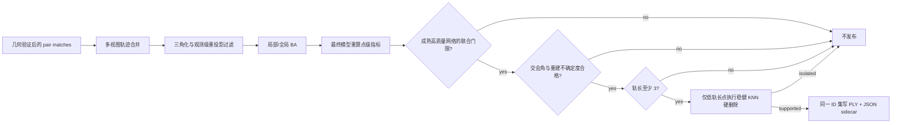

# Metashape 稀疏连接点飞点机制与 PlaScan 优化报告

> 分析日期：2026-08-26 至 2026-08-27
> 分析类型：授权离线 PE 静态逆向 + PlaScan 白盒代码审计与实现
> 报告结构：`flavor = null`（普通算法逆向，不套 malware/APT 模板）

## 执行摘要

PlaScan 稀疏点云飞点明显多于 Metashape 的核心原因不是单一匹配器，而是最终质量闭环不完整。高质量空三内部按 1.5 px 清理观测，但旧发布路径又用固定 4 px 接纳 PLY 点；删除坏观测后只剩两视图的点仍可存活；最终输出也没有真正执行重建不确定度和空间孤立过滤。Metashape 2.3.1 的静态证据则显示两层设计：`MatchPhotos/filter_weak_points` 位于匹配阶段，`TaskCleanTiePoints` 在对齐后按重投影误差、重建不确定度、影像数和投影精度进行渐进式选择/删除。

本次已把最值得借鉴的“最终模型多指标清理”落入 PlaScan，并用用户提供的同一 128 影像航块校准。PlaScan 原始 38,692 点的稳健 KNN 空间离群候选率为 15.6%，Metashape 21,787 个活动 tie points 为 7.0%；PlaScan 人工清理后的 28,274 点则降至 4.6%。人工保留集合可由“轨长、重投影误差、交会角、重建不确定度”联合门控以 99.6% Jaccard 复现。最终实现因此以多指标几何门为主，仅对低轨长空间离群点硬删除。该处理只改变最终发布集合，不修改相机位姿和内部 reconstruction；PLY 与 JSON sidecar 使用同一组点 ID。

## 范围与证据基础

- 授权与范围：[scope.md](reverse_metashape/local-evidence.md)
- 时间线：[timeline.md](reverse_metashape/local-evidence.md)
- Evidence 索引：[evidence/INDEX.md](reverse_metashape/local-evidence.md)
- 样本：Metashape 2.3.1 `metashape.exe`，x64 PE，SHA-256 `457BC052641A52C938CBED51C98E927A1C9120A7694F7CCF0E2F1E942B5F3E50`（E-001）
- 工具：Ghidra 12.1.3 headless、PowerShell、dumpbin、ripgrep、CMake/MSVC、GTest
- 动态分析：未执行；本结论不依赖运行时 Hook。

边界说明：逆向证据确认 Metashape 存在弱点过滤、清理任务和四类判据，但没有恢复其闭源内部的精确指标公式、默认数值阈值，也不能声称所有判据在每次 Align Photos 中默认自动执行。

## 问题根因

| 根因 | PlaScan 旧行为 | 为什么会形成飞点 | 证据 |
|------|----------------|------------------|------|
| 门限不一致 | 高质量 SfM 为 1.5 px，发布固定放宽到 4 px | 最终 BA 后重新变差的点仍进入 PLY | E-003 |
| 两视图支持过弱 | 坏观测被删除后，剩余两观测即可保点 | 错误对应也可能取得低像素残差和一个可用基线 | E-003 |
| 只看最佳基线 | 过滤使用 track 的最大交会角 | 一个好像对会掩盖其余弱基线观测 | E-003 |
| 无最终空间检查 | 空三输出没有调用已有稳健统计过滤 | 与主体点云相距很远但局部指标合格的点留下 | E-003 |
| 指标只记录不决策 | 重建不确定度、投影精度进入 sidecar，但没有数值门禁 | 退化交会没有形成发布决策 | E-003 |

匹配阶段并非完全没有防护。PlaScan 已有 USAC 几何验证、直接边检查、长轨迹共识、两视图碎片抑制、深度不确定度和局部深度一致性。这些措施保护了主 SfM，但无法替代“最终 BA 模型上的统一发布清理”，因为点坐标、观测集合和误差会在后续优化中变化。

## Metashape 的分层设计

Ghidra 对显式字符串地址的 xref 和反编译得到以下可复核事实（E-002）：

- `MatchPhotos/filter_weak_points` 有 4 个引用，并映射到 `match/filter_weak_points`，说明弱点过滤属于匹配任务配置，不只是 GUI 文案。
- `FUN_140795bc0` 构造 `TaskCleanTiePoints` 与 `TaskCleanTiePointsParams`。
- `CleanTiePointsDialog` 的判据枚举为：0 重投影误差、1 重建不确定度、2 影像数、3 投影精度。
- `FUN_1403ed760` 暴露 “Filter tie points by projections count” 与 “Clean Tie Points...” 操作。

最值得学习的不是照抄未知阈值，而是它把误差处理拆成不同生命周期：匹配时过滤弱对应，SfM/BA 保持足够观测用于求解，对齐完成后再基于最终模型清理 tie point cloud。

## 优化后的 PlaScan 路径



实现位于 `src/core/aerial_triangulation/reporting/QualityReportWriter.cpp`：

| 门禁 | 高质量默认 | 设计理由 |
|------|------------|----------|
| RMS 重投影误差 | ≤ 1.2 px | 同航块人工结果近似阈值为 1.1 px，留出数值余量 |
| 最大有效交会角 | ≥ 7.5° | 同航块人工保留集合下界为 7.66° |
| 重建不确定度 | ≤ 30 | 同航块人工保留集合上界为 26.03，留出跨航块余量 |
| 观测影像数 | ≥ 3 | PlaScan 强两视图点在实测中仍明显扩大离群长尾 |
| 空间孤立 | K=16，median/MAD + 3σ，且轨长 = 3 | 只清理最低保留轨长，保护高冗余屋檐/立面边界 |
| 人工先验标记 | 不参加自动几何/空间弱点删除 | 避免静默删除控制点；仍要求有限坐标和完整指标 |

投影精度当前仍写入 sidecar，但没有自动设硬阈值。PlaScan 的该值来自特征尺度均值，尚未证明与 Metashape 的 Projection Accuracy 数值同标度；未经标定直接套用 2 或 3 会误删大尺度但稳定的 SIFT 特征。

上述成熟网络门限只在 `quality >= 2` 且已注册相机数不少于 8 时启用；小网络继续使用较宽门限和两视图组合检查。每次结果都会在 `sfmDiagnostics.sparse_point_cleanup` 写出重建点数、指标完整点数、发布点数，以及按重投影、轨长、交会角、不确定度、弱两视图和空间孤立分别删除的数量。

## Evidence → Finding → Path

### Evidence

| E-id | source_ref | repro_command | content_hash |
|------|------------|---------------|--------------|
| E-001 | 本机合法 Metashape PE | PowerShell 哈希/签名 + dumpbin | 样本 SHA-256 见上文 |
| E-002 | Ghidra 显式地址导出 | `ExportAddressEvidence.java` | 导出 SHA-256 `CC730B...BC07` |
| E-003 | PlaScan SfM/发布源代码 | `rg` + 白盒路径审计 | n/a |
| E-004 | 优化代码与 GTest | CMake build + `run_tests.py` | n/a |
| E-005 | 用户提供的同航块 PlaScan/Metashape 工程 | `analyze_sparse_clouds.py` | 三个输入 SHA-256 见 E-005 |

### Findings

| F-id | severity | evidence_ids | confidence | location | status |
|------|----------|--------------|------------|----------|--------|
| F-001 Metashape 采用前端弱点过滤与对齐后多指标清理 | n/a_re | E-001,E-002 | high | MatchPhotos/TaskCleanTiePoints | validated |
| F-002 PlaScan 1.5 px 内部门与 4 px 发布门不一致 | medium | E-003 | high | SfmAttemptRunner/QualityReportWriter | validated |
| F-003 两视图存活与最大夹角不足以独立抑制飞点 | medium | E-003 | high | Triangulator/IncrementalSfm | validated |
| F-004 最终模型多指标门禁已实现并通过回归 | n/a_re | E-004 | high | QualityReportWriter/ResultWriter | validated |
| F-005 原始 PlaScan 离群长尾主要来自低轨长弱几何点 | medium | E-005 | high | 同航块稀疏点实测 | validated |

### Path P-001：修复路径

- path_type: `solve`
- source: 原始匹配轨迹
- goal: 低飞点率且 PLY/sidecar 一致的最终稀疏点云
- steps:
  1. 在主 SfM 内保留必要的两视图点用于 PnP 和 BA（E-003/F-003）。
  2. 在最终 reconstruction 上重新计算点误差、交会角、不确定度和观测数（E-004/F-004）。
  3. 成熟高质量网络应用多视图联合门，稳健 KNN 只硬删除低轨长离群点（E-004,E-005/F-004,F-005）。
  4. 由 `publishedPointIds` 同步驱动 PLY 和 sidecar（E-004/F-004）。

## 验证结果

实际执行：

```powershell
cmake --build build/windows-source-release `
  --target test_aerial_triangulation_pipeline `
           test_aerial_triangulation_result_writer `
           test_sparse_point_cloud_processor `
           test_triangulation_quality `
  --parallel 8

python scripts/env/run_tests.py `
  --test-dir build/windows-source-release `
  --output-on-failure `
  -R 'AerialTriangulationPipelineTest|AerialTriangulationResultWriterTest|SparsePointCloudProcessorTest|TriangulationQualityTest'
```

结果：受影响目标构建成功。新增合成回归覆盖小网络的弱两视图/空间离群清理，以及成熟高质量网络拒绝两视图发布点的策略。

## 同航块实测

| 结果 | 点数 | 两视图点 | 稳健 KNN 离群候选 | 比例 |
|------|-----:|---------:|-------------------:|-----:|
| PlaScan 原始 | 38,692 | 7,281 | 6,039 | 15.6% |
| PlaScan 人工清理 sidecar | 28,274 | 0 | 1,311 | 4.6% |
| PlaScan 人工清理 PLY | 27,513 | 未导出轨长 | 1,096 | 4.0% |
| Metashape 活动 tie points | 21,787 | 12,031 | 1,521 | 7.0% |

PlaScan 原始结果的中位重投影误差为 0.440 px，并非整体 BA 发散。空间最差 1% 点的轨长中位数为 2、最大交会角中位数为 7.81°、重建不确定度中位数为 18.38；全体点分别为 4、32.39°、4.97。人工清理规则反推及完整数据见 E-005。

按新策略对旧 sidecar 离线回放，联合几何门保留 28,400 点，条件空间门再删除约 565 点，预计发布 27,835 点。该数值是策略回放，不是新版本完整重跑结果；下一步应重跑相同航块，并检查 `sparse_point_cleanup`、相机注册数、BA RMS 和 MVS 完成率。若仍出现成簇飞点，下一阶段应加强匹配阶段的两视图置信度与环路一致性，而不是继续提高全局 KNN 删除强度。
