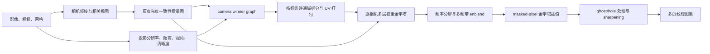

# Metashape Natural 纹理生成逆向与 PlaScan 对齐报告

> 结论：已经还原 Natural 的主调用链并建立同数据、同参数、固定相机的量化测试；PlaScan 的改进版优于原基线，但仍未达到可声明为 Metashape 等价替换的门槛。

## 执行摘要

本次分析对象是本地 Metashape 2.3.1 项目及其 8192×8192 双页纹理，授权范围见 [`scope.md`](reverse_metashape/local-evidence.md)。静态 PE 证据与动态日志一致表明，Natural 不是普通加权平均：它先建立相机邻接和灰度光度一致性质量，求每面 camera winner graph，再对每个相机生成权重金字塔并做多频带 enblend，最后执行掩膜插值、hole/ghost 处理与锐化。

同参数 Metashape 重建与保存参考在八个固定相机上达到 44.85 dB，证明比较链可靠。PlaScan 改进版由 15.48 提升到 16.18 dB；即使在临时上界实验中直接注入 Metashape winner，也只有 19.75 dB。因此当前实现适合作为可测量的质量改进，但不能标记为已完成等价替换；下一步必须实现有界内存的逐相机权重/拉普拉斯金字塔，并把 winner 质量从单点颜色扩展为邻相机局部灰度一致性图。

## 分析对象与参数

| 项目 | 值 |
|---|---|
| Metashape | Professional 2.3.1 build 22416，PE SHA256 `457bc052...b5f3e50` |
| 参考网格 | 3,750,233 顶点，7,485,956 面；PLY 含逐面 camera、UV 与 texnumber |
| 参考图集 | 两页 8192×8192 RGB TIFF |
| UV | `page_count=2` |
| Texture | Natural/blending mode 5，downscale 2，AA 1，fill holes，ghost filter，sharpening 1 |
| 禁用项 | out-of-focus filter、color enhancement |
| PlaScan ROI | 100,000 面，241,039 顶点，32 个相机，8192 图集 |

## 还原的算法

Natural 的有效数据流如下。该图是静态字符串/xref、反编译结果和运行时阶段日志的交集，不包含许可证或激活逻辑。



官方 2.3 文档对 Natural 的行为描述与上述证据一致：选择阶段考虑分辨率、距离、视角、清晰度和 ghost；融合阶段把图像分解到频率金字塔，平滑低频而保留清晰高频。实现细节证据位于 [`E-002`](reverse_metashape/local-evidence.md)，动态证据位于 [`E-003`](reverse_metashape/local-evidence.md)。

## 同参数复现与比较方法

不能直接比较 atlas 文件哈希，因为 Natural 的 UV/页内打包在重复运行间不保证字节级稳定。测试先用 Metashape 的正常 Python API 在项目副本上重建纹理，再把保存参考和候选模型从完全相同的八个相机渲染为 RGBA，最后只在共同覆盖像素上计算 MAE、RMSE、PSNR、低频误差和高频误差。

核心复现入口均保留在 `build/tmp/metashape-texture-reverse/`：

```powershell
D:\metashape2.3.1\metashape.exe -r build\tmp\metashape-texture-reverse\metashape_build_variant.py
D:\metashape2.3.1\metashape.exe -r build\tmp\metashape-texture-reverse\metashape_render_roi_models.py
.\.venv\Scripts\python.exe build\tmp\metashape-texture-reverse\compare_rendered_views.py `
  --reference-dir build\tmp\metashape-texture-reverse\roi\renders\reference `
  --candidate-dir build\tmp\metashape-texture-reverse\roi\renders\plascan_natural_final `
  --output-json build\tmp\metashape-texture-reverse\results\metashape-vs-plascan-natural-final.json
```

## 量化结果

| 候选 | Coverage IoU | MAE | PSNR | 低频灰度 MAE | 高频灰度 MAE |
|---|---:|---:|---:|---:|---:|
| Metashape 同参数 Natural | 1.000 | 0.608 | 44.85 dB | 0.082 | 0.355 |
| PlaScan 原基线 | 1.000 | 30.681 | 15.48 dB | 2.845 | 27.614 |
| PlaScan 改进版 | 1.000 | 27.853 | 16.18 dB | 2.581 | 24.964 |
| PlaScan + Metashape winner 上界实验 | 1.000 | 18.577 | 19.75 dB | 1.519 | 17.040 |

改进版相对基线降低了约 9.2% 的 MAE，并提高 0.69 dB PSNR。Oracle 实验把相机选择误差与融合误差分开：完全相同的 winner 能明显改善结果，但仍无法补足逐相机权重金字塔带来的中高频融合。

## PlaScan 改动

- `TextureNaturalBlender.h/.cpp`：在 linear-sRGB 中计算掩膜归一化低频，使用鲁棒多视图低频校正主视图，同时保留主视图高频。
- `TextureAtlasBaker.cpp`：同时烘焙鲁棒颜色和 primary/winner 颜色，统一扩展 chart 边界后执行全图五层 Natural 校正，再锐化。
- `TextureVisibilityEvaluator.cpp`：避免过早饱和投影分辨率，并在 ghost filter 开启时用候选中心亮度的 median/MAD 做保守光度一致性重排。
- `test_texture_natural_blender.cpp`：验证低频替换、主视图细节保留和掩膜外不写入。
- `PROJECT_ARCHITECTURE.md`：登记新模块边界。

## Evidence → Finding → Path

| Finding | 状态 | 证据 | 结论 |
|---|---|---|---|
| F-001 | validated / high | E-001, E-002, E-003 | Natural 是 winner graph + 逐相机权重金字塔 + enblend 管线 |
| F-002 | validated / high | E-003, E-004 | PlaScan 尚未达到替换一致性，差距同时位于 winner 与频率融合 |
| F-003 | validated / high | E-004, E-005 | 当前改动有稳定增益并通过相关回归，但只是阶段性改进 |

完整字段化 Finding 与调用 Path `P-001` 见 [`case report`](reverse_metashape/local-evidence.md)，时间线见 [`timeline.md`](reverse_metashape/local-evidence.md)。

## 构建与验证

```powershell
.\.venv\Scripts\python.exe scripts\env\configure_with_env.py --source-deps
cmake --build build\windows-source-release --config Release `
  --target test_texture_natural_blender texture_map_cli --parallel
.\.venv\Scripts\python.exe scripts\env\run_tests.py `
  --test-dir build\windows-source-release --output-on-failure `
  -R 'TextureNaturalBlender|TextureMapperTest|TextureSeamLeveling'
```

结果：Windows/MSVC Release 构建通过，41/41 个相关测试通过；临时 Python 脚本通过 `py_compile`。新增的独立 C++ 文件和测试已用 MSVC LLVM `clang-format` 按仓库 `.clang-format` 处理；旧文件只保留局部逻辑差异。`git diff --check` 通过，仅显示工作区的 LF→CRLF 提示。

## 剩余替换门禁

在满足以下条件前，不应把当前结果标记为 Metashape 等价替换：

1. 以 atlas tile 或流式 camera batch 实现有界内存的逐相机 Gaussian weight 与 Laplacian color pyramid。
2. 基于网格重投影的局部灰度 patch/ZNCC 构建相机 photo-consistency quality map，而不是只用面中心亮度。
3. 复刻 winner graph 的连通性优化和小页合并逻辑，避免 PlaScan ROI 中约 8 万个碎片 chart。
4. 在完整 7,485,956 面模型和至少八个固定相机上重新比较；建议门禁为 coverage IoU=1、PSNR 接近同参数 Metashape 自复现，并人工检查 ghost、seam、hole 与锐化伪影。

## 参考资料

- [Agisoft Metashape 2.3 新功能说明](https://agisoft.freshdesk.com/support/solutions/articles/31000177202-new-features-in-agisoft-metashape-2-3)：Natural texture mapping 的目标与频率融合概述。
- [Agisoft Metashape Professional 2.3 用户手册](https://www.agisoft.com/pdf/metashape-pro_2_3_en.pdf)：Build Texture 参数与 Natural blending 行为。
- [Agisoft Metashape Java API `BuildTexture`](https://download.agisoft.com/metashape-java-api/latest/com/agisoft/metashape/tasks/BuildTexture.html)：任务参数、默认值与枚举接口。

本报告没有复制厂商实现代码；结论来自授权的本地只读静态分析、正常 API 动态复现和独立实现的固定视角量化测试。
