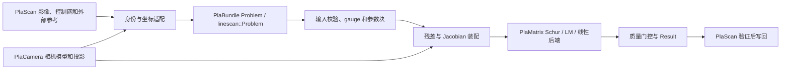

# PlaBundle 设计与文件导览

> 本文基于 PlaScan 固定的 PlaBundle 0.1.0 子模块源码。除特别说明外，下文路径均相对 `3rdparty/plabundle/`。

## 1. 项目定位

PlaBundle 是独立的 C++20 光束法平差与控制网优化库。它接收相机数值状态、像点观测、三维点、rig 拓扑和物方约束，构建非线性最小二乘问题，使用 PlaMatrix 的块法方程与 Schur 求解器优化，再返回相机、点、状态、质量统计和后端诊断。面阵和行星线阵有不同的公开求解入口。

| 组件 | 所拥有的职责 | 与 PlaBundle 的关系 |
| --- | --- | --- |
| PlaCamera | 相机定义与实例、面阵数值状态、投影/线性化、位姿更新、rig 拓扑 | PlaBundle 面阵公开接口直接使用 `placamera::FramePinholeNumericState` 和 `placamera::RigTopology`。 |
| PlaMatrix | 矩阵、鲁棒损失、LM 策略、块 Schur 方程、CPU/设备线性求解 | PlaBundle 的私有数值后端；不向公开头暴露 PlaMatrix 类型。 |
| PlaBundle | BA 问题、约束、参数分组、gauge、后端策略、求解流程、结果质量门控 | 本文主体。 |
| PlaScan | 影像/控制网身份映射、文件与工程存储、坐标系预处理、GUI/CLI、结果发布 | 构造 PlaBundle 输入并决定何时写回结果。 |

PlaBundle 不读取 ISIS、PVL 或工程文件，也不隐式执行坐标系转换。调用方必须先把相机和物方约束放到一致的米制求解坐标系。`include/plabundle/` 的公开头不引入 Qt、OpenCV、GDAL、PlaPoint 或 PlaScan 类型。



## 2. 两条求解入口

### 面阵与 rig BA

`include/plabundle/problem.h` 定义 `Problem`：`cameras` 是 PlaCamera 面阵数值状态；`tracks` 是三维点及像点观测；可附加固定块、共享内参分组、位姿先验、控制点、比例尺、激光测距和 `RigTopology`。`include/plabundle/options.h` 将控制项分为求解、标定、约束、后端与质量门控五组，同时保留平铺的兼容 `Options`。`Solver::solve()` 接收不可变输入；`Result::usable()` 才表示结果可发布。

调用链是 `solver.cpp` 校验和选择后端 → `Conversion.cpp` 转换公开/内部结构 → `BundleAdjustValidation.cpp` 处理有效观测与 gauge → `BundleAdjustPlaMatrixProblem.cpp` 建立活动参数块 → `BundleAdjustPlaMatrixAssembly.cpp` 装配残差和法方程 → `BundleAdjustPlaMatrix.cpp` 执行 LM/Schur → `BundleAdjustQuality.cpp` 重算 RMS、过滤无效点并执行质量门控 → `Conversion.cpp` 输出公开 `Result`。`SolverWorkspace` 可由调用方在顺序运行的多次 BA 中复用线性求解工作区，不能由并发求解共享。

`CameraState` 是 PlaBundle 内部对 `FramePinholeNumericState` 的求解适配器：其常规投影、位姿更新和 bundle 线性化调用 PlaCamera；PlaBundle 把导数映射到自身的相机、点和共享内参参数块。部分残差路径另用 `BundleAdjustProjection.h` 中的轻量相机快照和模板化 Brown 投影，须与 PlaCamera 的坐标/畸变约定保持一致。Rig 的 capture/sensor 组合调用 PlaCamera。`PhotoAlignmentOutcome` 只用于按稳定 ID 对齐并比较两个求解结果，不解析外部工程格式。

### 行星线阵 BA

`include/plabundle/linescan.h` 定义独立的 `plabundle::linescan::Problem`、`Options`、`Result` 和 `solve()`。它优化逐影像 6DoF 改正、连接点及可选激光点。投影可以由 `CameraModel` 中的轨迹/行时模型提供，也可以由调用方提供回调。当前 PlaScan 行星推扫入口采用回调，在回调内调用 PlaCamera 线阵实例的 `projectAtLine()`；因此“线阵使用 PlaCamera”是调用方适配关系，并非 `linescan::Problem` 强制持有 PlaCamera 线阵类型。

线阵链路由 `linescan.cpp` 校验问题并控制发布，`linescan_model.cpp` 计算投影/残差，`linescan_assembly.cpp` 形成块法方程，`linescan_plamatrix.cpp` 调用 PlaMatrix 迭代和线性后端。指针式 `solve(Problem*, ...)` 是兼容入口，仅在解被接受后将结果写回输入问题；首选返回 `Result` 的不可变入口。

## 3. 目录、构建目标与依赖

```text
3rdparty/plabundle/
├── include/plabundle/   公开 API（10 个头）
├── src/                 实现与内部接口（51 个文件）
│   └── internal/        面阵 BA 的参数、装配、Schur、质量与转换
├── test/                GTest、公开头编译检查和边界检查（18 个文件）
├── benchmark/           求解性能基准
├── examples/consumer/   最小消费示例
├── cmake/               安装包配置模板
└── docs/                与 Align Photos 适配的字段映射
```

| 目标/开关 | 当前作用 |
| --- | --- |
| `plabundle::plabundle` | 单个静态库；公开链接 `placamera::placamera`，私有链接 `plamatrix::plamatrix`，可选私有链接 OpenMP。 |
| `PLABUNDLE_BUILD_TESTS` | 独立构建默认开启；需要 GTest，产生 `test_plabundle` 和边界检查。 |
| `PLABUNDLE_BUILD_BENCHMARKS` / `PLABUNDLE_BUILD_EXAMPLES` | 默认关闭；分别生成基准和消费示例。 |
| `PLABUNDLE_ENABLE_OPENMP` | 默认开启内部循环的 OpenMP。 |
| `PLABUNDLE_INSTALL` | 独立构建默认开启，作为子目录加入父工程时默认关闭；控制安装和 CMake 包导出。 |
| `PLABUNDLE_PLAMATRIX_SOURCE_DIR` / `PLABUNDLE_PLACAMERA_SOURCE_DIR` | 独立开发构建时可指定依赖源码；未指定且父工程尚无对应 target 时使用 `find_package(... CONFIG REQUIRED)`。 |
| `plabundleConfig.cmake` | 安装后先查找 PlaMatrix 和 PlaCamera，再加载导出 target。 |

PlaBundle 的 CMake 没有单独的 CUDA/Vulkan/OpenCL 编译开关；加速能力来自所链接的 PlaMatrix。`Backend::Auto` 根据问题规模和设备能力选后端；设备候选失败或未过质量门控时，按选项决定是否重新在 CPU 上求解。后端选择与回退原因写入 `Result`。

控制点与位姿先验的协方差白化、平方根信息矩阵乘法，以及自适应相机模型中的 3×3 求逆和小型线性系统求解已使用 PlaMatrix。`BundleAdjustPlaMatrixReferenceSchur.cpp` 的逐点消元现调用 PlaMatrix 的行优先固定 3×3 受检求逆；块累加仍由 PlaBundle 实现，因为它负责将点约束映射到相机、rig 与内参参数块。不能据此推断所有标量或矩阵算术都由 PlaMatrix 执行。

## 4. 逐文件清单

### 根目录、CMake、文档与示例

| 文件 | 作用 |
| --- | --- |
| `CMakeLists.txt` | 查找/加入依赖，定义库、可选测试/示例/基准和安装导出规则。 |
| `CMakePresets.json` | 独立 Ninja Release 的 configure/build/test preset。 |
| `cmake/plabundleConfig.cmake.in` | 安装包的 `find_dependency(plamatrix)`、`find_dependency(placamera)` 和导出 target 加载。 |
| `README.md` | 使用、构建、相机/PlaMatrix 边界、约束、线阵与后端说明。 |
| `CHANGELOG.md` | PlaBundle 自身版本变更记录。 |
| `LICENSE` | 项目许可证。 |
| `docs/ALIGN_PHOTOS_INTEGRATION.md` | Align Photos 字段到 PlaBundle/PlaCamera 的映射、单位/坐标转换和不支持组合。 |
| `examples/consumer/CMakeLists.txt` | 安装后 `find_package(plabundle)` 的消费工程配置。 |
| `examples/consumer/main.cpp` | 构造两台 PlaCamera 面阵相机、一条轨迹并调用 `Solver` 的最小示例。 |
| `benchmark/plabundle_benchmark.cpp` | 生成合成相机/轨迹，测量求解耗时与结果。 |

### 公开头 `include/plabundle/`

| 文件 | 作用 |
| --- | --- |
| `version.h` | 0.1.0 版本常量。 |
| `backend.h` | 后端、求解状态、能力和选择决定的数据类型及名称接口。 |
| `constraints.h` | 像点、轨迹、控制点、比例尺、位姿先验、相机平面、激光平面/测距约束。 |
| `problem.h` | 面阵 `Problem`、gauge 策略、问题规模统计和输入校验。 |
| `options.h` | 结构化 `SolveOptions`、兼容 `Options`、鲁棒损失/内参掩码及验证/转换。 |
| `solver.h` | `Solver`、可复用 `SolverWorkspace`、后端可用性与选择 API。 |
| `result.h` | 优化后的相机、点、rig、质量统计、耗时、PlaMatrix 诊断与 `usable()`。 |
| `adaptive_camera_model.h` | 基于问题评估可放开的内参、应用参数掩码及恢复未启用内参。 |
| `photo_alignment.h` | 按稳定 ID 描述、校验和比较摄影测量对齐结果。 |
| `linescan.h` | 线阵问题、轨迹/行时模型、投影回调、激光约束和求解结果。 |

### `src/` 顶层实现与私有接口

| 文件 | 作用 |
| --- | --- |
| `adaptive_camera_model.cpp` | 公开自适应内参评估接口到内部评估器的转换。 |
| `backend.cpp` | 后端和求解状态的名称映射。 |
| `control_point.cpp` | 控制点各向同性、协方差与平方根信息矩阵的校验/白化。 |
| `control_point_internal.h` | 控制点白化结构和内部计算声明。 |
| `pose_prior.cpp` | 位姿先验协方差/信息矩阵校验和白化。 |
| `pose_prior_internal.h` | 位姿先验白化结构和内部接口。 |
| `options.cpp` | 结构化与平铺选项互转、参数启用判断及选项合法性校验。 |
| `problem.cpp` | 面阵问题规模统计；相机、观测、约束、rig/gauge 的入口校验。 |
| `photo_alignment.cpp` | 求解结果快照构造、按稳定 ID 对齐和差异比较。 |
| `solver.cpp` | 面阵公开入口、后端选择/回退、质量门控和失败结果包装。 |
| `linescan.cpp` | 线阵输入校验、后端选择、质量判定与不可变/兼容求解入口。 |
| `linescan_model.cpp` | 轨迹/行时的线阵投影与影像/激光残差计算。 |
| `linescan_internal.h` | 线阵残差、RMS 与 PlaMatrix 求解内部接口。 |
| `linescan_assembly.cpp` | 线阵观测和激光约束装配、目标函数、增量应用。 |
| `linescan_assembly.h` | 线阵块方程装配内部声明。 |
| `linescan_plamatrix.cpp` | 线阵 LM/Schur 迭代与 PlaMatrix 线性后端选择。 |

### `src/internal/` 面阵 BA 内核

同名 `.h` 声明内部结构和函数，`.cpp` 实现对应流程。以下仍分别列出每个文件，以便定位改动。

| 文件 | 作用 |
| --- | --- |
| `BundleAdjustTypes.h` | 公开后端、状态、参数和规模类型的内部别名及决定结构。 |
| `BundleAdjustProblem.h` | 观测/约束/轨迹内部别名和附加启用状态。 |
| `BundleAdjustOptions.h` | 向内部问题补入固定块、rig、约束等的 `BAOptions`。 |
| `BundleAdjustResult.h` | 后端原始相机/点结果、约束统计和求解诊断。 |
| `CameraState.h` | PlaCamera 面阵数值状态的内部求解接口与参数块定义。 |
| `CameraState.cpp` | PlaCamera 投影、bundle 线性化、位姿/内参更新的适配实现。 |
| `Conversion.h` | 公开 `Problem`/`Result` 与内部 BA 结构转换的声明。 |
| `Conversion.cpp` | 构造内部选项并将后端结果映射回公开 `Result`。 |
| `BundleAdjustValidation.h` | 观测有效性、问题统计、gauge 规范化的接口和诊断类型。 |
| `BundleAdjustValidation.cpp` | 检查输入并按策略固定参考相机/尺度。 |
| `BundleAdjustAdaptiveCameraModel.h` | 内部自适应内参评估、掩码应用与恢复的接口。 |
| `BundleAdjustAdaptiveCameraModel.cpp` | 根据观测和相机状态选择可优化内参。 |
| `BundleAdjustPlaMatrix.h` | PlaMatrix 面阵后端主入口及设备可用性接口。 |
| `BundleAdjustPlaMatrix.cpp` | 非线性迭代、LM trial、Schur 线性求解、接受/拒绝步骤和诊断。 |
| `BundleAdjustPlaMatrixRuntime.h` | PlaBundle 后端到 PlaMatrix 线性后端的映射声明。 |
| `BundleAdjustPlaMatrixRuntime.cpp` | 后端能力与设备可用性检查、名称映射。 |
| `BundleAdjustPlaMatrixProblem.h` | 活动相机/rig/内参/点块索引、共享内参组和参数布局。 |
| `BundleAdjustPlaMatrixProblem.cpp` | 根据固定块与有效观测构造活动问题、分配参数块。 |
| `BundleAdjustPlaMatrixModel.cpp` | 初始化共享内参组、阶段启用、增量更新和发布内参。 |
| `BundleAdjustPlaMatrixProjection.h` | 像点鲁棒代价、共享内参相机和线性化接口。 |
| `BundleAdjustPlaMatrixProjection.cpp` | 计算重投影残差、鲁棒权重及相机/点 Jacobian。 |
| `BundleAdjustProjection.h` | 轻量相机快照及模板化 Brown 投影、局部位姿参数化。 |
| `BundleAdjustProjection.cpp` | 从 `CameraState` 复制出供模板化残差使用的相机快照。 |
| `BundleAdjustPlaMatrixConstraints.h` | 激光、控制点、比例尺、位姿先验等约束线性化接口。 |
| `BundleAdjustPlaMatrixConstraints.cpp` | 各类物方约束的残差和 Jacobian 计算。 |
| `BundleAdjustPlaMatrixAssembly.h` | 法方程构建、目标函数和参数增量应用入口。 |
| `BundleAdjustPlaMatrixAssembly.cpp` | 观测/点/相机/rig/内参块装配与增量应用。 |
| `BundleAdjustPlaMatrixAssemblyInternal.h` | 装配过程共用的主块项、观测项和辅助函数声明。 |
| `BundleAdjustPlaMatrixAssemblySurvey.cpp` | 物方测量约束的法方程装配。 |
| `BundleAdjustPlaMatrixReferenceSchur.h` | 在线点 Schur 的工作区、回代数据及入口。 |
| `BundleAdjustPlaMatrixReferenceSchur.cpp` | 逐点消元、构造约化法方程和恢复点增量。 |
| `BundleAdjustQuality.h` | 离群点阈值、结果复核和约束质量门控接口。 |
| `BundleAdjustQuality.cpp` | 重算前后 RMS、正深度/有效点、约束质量并完成结果。 |
| `OpenMpCompat.h` | OpenMP 与非 OpenMP 编译路径的最小适配。 |
| `ParallelFor.h` | 内部并行循环辅助。 |

### `test/`

| 文件 | 作用 |
| --- | --- |
| `CMakeLists.txt` | 组装 `test_plabundle`、GTest 发现和三个 CMake 边界测试。 |
| `test_covariance_whitening.cpp` | 控制点与位姿先验的协方差白化、奇异性和分量选择验证。 |
| `test_native_problem.cpp` | PlaCamera 面阵数值状态验证、规模统计和在线 Schur 面阵求解回归。 |
| `test_covariance_whitening.cpp` | 控制点与位姿先验的协方差白化数值检查。 |
| `test_linescan.cpp` | 线阵投影/Jacobian、可观测性、激光约束、取消和兼容发布。 |
| `test_options.cpp` | 新旧选项互转、默认值和校验语义。 |
| `public_header_adaptive_camera_model.cpp` | 自适应相机公开头的独立编译检查。 |
| `public_header_backend.cpp` | 后端公开头的独立编译检查。 |
| `public_header_constraints.cpp` | 约束公开头的独立编译检查。 |
| `public_header_linescan.cpp` | 线阵公开头的独立编译检查。 |
| `public_header_options.cpp` | 选项公开头的独立编译检查。 |
| `public_header_photo_alignment.cpp` | 摄影测量对齐公开头的独立编译检查。 |
| `public_header_problem.cpp` | 面阵问题公开头的独立编译检查。 |
| `public_header_result.cpp` | 结果公开头的独立编译检查。 |
| `public_header_solver.cpp` | 求解器公开头的独立编译检查。 |
| `public_header_version.cpp` | 版本公开头的独立编译检查。 |
| `check_public_dependencies.cmake` | 禁止公开头泄漏 PlaScan/Qt/PlaPoint 类型或本机绝对路径。 |
| `check_camera_boundary.cmake` | 检查旧 PlaBundle 相机/rig 类型未重回公开接口。 |
| `check_plamatrix_boundary.cmake` | 审核 PlaMatrix 头文件白名单和旧矩阵类型使用。 |

## 5. 集成与验证边界

PlaScan 在 `cmake/PlascanPackages.cmake` 中依次加入 PlaMatrix、PlaCoordinate、PlaCamera 和 PlaBundle，使 PlaBundle 获得已经定义的依赖 target。主工程关闭 PlaBundle 的独立安装导出规则；独立构建默认保留该规则。GitHub Actions 的显式子模块初始化列表包含这四个库。PlaBundle 的独立构建说明同时列出 PlaMatrix、PlaCamera 和 PlaCoordinate 前置条件。

`test/test_native_problem.cpp` 覆盖一个实际面阵在线 Schur 求解案例，另有线阵、白化、选项和依赖边界测试。这些测试验证已覆盖的输入和后端路径，不能代替真实数据集上的摄影测量精度评估或安装后消费链路测试。

继续阅读可从 `include/plabundle/solver.h` 和 `src/solver.cpp` 入手；需要改像点/约束方程时看 `src/internal/BundleAdjustPlaMatrixProjection.cpp`、`BundleAdjustPlaMatrixConstraints.cpp` 和 `BundleAdjustPlaMatrixAssembly.cpp`；线阵问题从 `include/plabundle/linescan.h` 和 `src/linescan.cpp` 入手。
