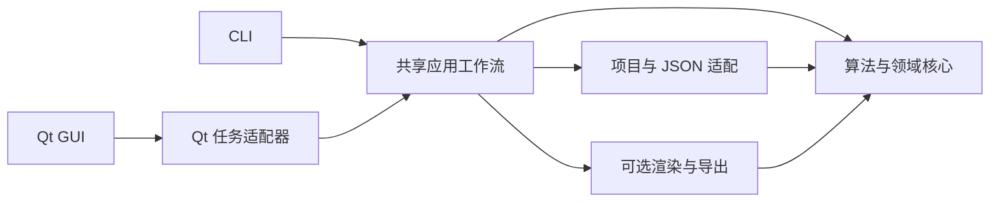

# PlaScan Core Qt 依赖与 GUI 职责解耦计划

更新日期：2026-09-12

状态：待实施

## 目标

本计划将 PlaScan 中的摄影测量算法、共享工程工作流、Qt 运行时适配和 GUI 展示职责逐步分开。
目标不是机械替换所有 Qt 类型，而是先消除影响 CLI、测试和核心复用的运行方式耦合，再收紧公开接口和
CMake 依赖。

实施完成后应具备以下能力：

- 算法目标可同步调用，不要求 `QObject`、Qt 事件循环或 `QtConcurrent`。
- GUI 和 CLI 共享相同的强类型请求、结果、取消和进度契约。
- 中文显示文本、列表名称、窗口状态和项目树刷新只在展示或适配层生成。
- JSON 只作为项目格式和外部交换格式，不再作为主要算法配置接口。
- Qt 图像/PDF 渲染成为显式、可选的输出模块，不改变算法本身的依赖边界。
- CMake 能分别验证算法目标、无 Widgets 的 CLI/工作流以及完整桌面应用。

## 当前基线

2026-09-12 的静态扫描结果如下：

- 排除测试后，`src/core` 约 848 个 C/C++ 源文件中有 267 个直接包含 Qt 头文件。
- 其中约 144 个公开或模块头文件暴露 Qt 类型；136 个头文件使用 `QString`/`QStringList`，67 个使用
  `QJson*`，53 个使用 Qt 容器。
- core 未直接依赖 Qt Widgets，也未直接包含 `src/gui`；问题主要集中在 Qt Core、Qt Gui、Qt Concurrent
  和职责混合。
- `DepthMapGenerator` 是 core 中最明显的 Qt 运行时边界：它同时承担 MVS 计算、后台线程、信号、
  产物持久化和 GUI 增量通知。CLI 因此也需要 `QEventLoop` 和 `QTimer`。
- `ProjectWorkflowOperations` 在 core 中拼接 `display_name`、`[当前]`、`[源 #]` 等展示文本。
- `ModelWorkflowService` 的主要请求和结果仍以裸 `QJsonObject settings/payload` 传递。
- `GlobalTerrainReportRenderer` 根据进程中是否存在 `QGuiApplication` 选择不同渲染行为。
- `task_runtime` 已经是 Qt-free；`sfm_core`、`sfm_postprocess` 和 `sfm_project` 的拆分可作为迁移范式。

这些数量只用于记录趋势。验收以目标边界是否成立为准，不以删掉多少个 `QString` 作为完成条件。

## 目标分层



各层职责如下：

| 层 | 允许承担的职责 | 不应承担的职责 |
|---|---|---|
| 算法与领域核心 | 相机、匹配、SfM、MVS、网格、地形算法；强类型配置和结果；同步执行；取消检查 | QObject 生命周期、事件循环、项目树刷新、界面文案、裸 JSON 配置 |
| 共享应用工作流 | 阶段编排、产物发布、工程会话协调、错误边界、结构化进度 | 窗口状态、对话框、菜单和本地化显示 |
| 项目与序列化适配 | 项目 schema、JSON 解析/写出、旧格式兼容、类型转换 | 算法决策和隐藏默认值 |
| Qt 任务适配器 | `QObject`、signals、`QFuture`、GUI 线程投递和生命周期绑定 | 算法实现和项目格式解释 |
| 渲染与导出 | QImage/PDF/字体、报告图片、纹理或标靶输出 | 根据宿主是否为 GUI 进程隐式改变结果 |
| GUI/CLI | 文案、本地化、用户交互、日志呈现和调用线程选择 | 复制算法规则或自行解释未验证的 JSON 字段 |

物理目录不要求第一阶段立即大搬迁。可以先在现有模块中拆 target，待接口稳定后再把共享应用层和 Qt
适配层迁移到独立目录，避免文件移动与行为修改出现在同一批差异中。

## 实施原则

- 每一批先固定现有行为，再调整边界；架构迁移不得顺带修改算法参数、默认值或输出质量。
- 先消除 GUI 语义和运行时耦合，再迁移 `QString`、Qt 容器等值类型。
- 保留兼容适配器，使 GUI 与 CLI 可以逐个迁移；不要求一次切换所有调用点。
- Qt 依赖按 target 隔离。允许渲染 target 依赖 Qt Gui，不允许因此让算法 target 传递依赖 Qt Gui。
- 项目 JSON schema 在本计划中默认保持兼容。只有确需改变持久化语义时才升级 schema 或缓存版本。
- 当前 `DepthMapGenerator.cpp` 和 recovered/model 相关文件有未提交工作。进入 MVS 拆分前必须重新冻结
  文件哈希和语义差异，不能覆盖或夹带这些改动。
- Windows/MSVC 与 Linux/GCC 使用同一接口设计；不为拆分引入编译器专用兼容分支。

## 阶段 0：建立边界清单和自动门禁

### 工作内容

1. 生成并保存 target 级依赖清单，记录每个 core target 的 Qt 组件、公开/私有链接关系及公开头文件中的
   Qt 类型。
2. 在 `docs/PROJECT_ARCHITECTURE.md` 中定义上述六层边界，并列出允许的依赖方向。
3. 增加轻量架构检查，阻止以下新增依赖：
   - core 算法 target 链接 `Qt6::Widgets`；
   - 算法头文件新增 `QObject`、`QFuture` 或 `QtConcurrent`；
   - core 新增 `QMessageBox`、`QDialog`、GUI 目录 include；
   - 算法结果新增仅供列表显示的 `display_name` 字段。
4. 将检查基线化：已有 `QString`、`QJsonObject` 不在第一批全部报错，只禁止数量和范围继续扩大。

建议新增 `scripts/validation/check_core_boundaries.py`，并由测试或 CI 调用。检查规则应基于明确的目录和
target 白名单，错误信息给出文件、禁止类型和应迁往的层。

### 完成条件

- 当前依赖清单可重复生成。
- 新增一个最小违规夹具时检查失败，移除违规后通过。
- 默认构建行为、项目格式和算法结果均未改变。

## 阶段 1：移出 GUI 展示语义

这是风险最低、应最先落地的生产改动。

### 1.1 统一结构化进度

引入不含本地化文本的共享事件，例如：

```cpp
enum class ProcessingStage;

struct ProcessingProgress
{
    ProcessingStage stage;
    std::uint64_t completed = 0;
    std::uint64_t total = 0;
    ProcessingMetrics metrics;
};
```

- core 只报告阶段、计数、后端标识和诊断值。
- GUI 将阶段映射为中文状态栏文字；CLI 将相同阶段映射为日志文字。
- 无可靠总量时用明确状态表示 indeterminate，不再通过 `total == 0` 隐式约定界面行为。
- 人类可读错误信息可以保留，但进度文本不能成为调用方解析的协议。

首批迁移 `MatchPhotosContext`、Terrain pipeline 和模型工作流；MVS 信号在阶段 2 随执行器一起迁移。

### 1.2 删除无消费者的项目展示摘要

- 删除已经失去消费者的 `summarizeAtResults()`；未来出现新的结果选择界面时，再按真实消费者需求定义
  强类型视图模型。
- `operation` 到中文展示名的映射移到 `src/gui`，CLI 根据自身输出格式处理。
- 继续保留历史记录中的 `operation_display_name`，但不将其作为算法或选择逻辑依据。
- 项目文件需要保存的快照式显示名由项目序列化适配层写入，不由算法工作流生成。

### 验证

- 为阶段枚举到 GUI/CLI 文案的映射分别增加测试。
- 验证旧项目展示字段原样保留，结果选择仍只依赖结构化业务字段。
- 搜索确认 core 的进度契约不再出现“面向 UI”文本，展示字段不参与业务判断。

### 完成条件

- GUI 和 CLI 显示与迁移前等价。
- core 工作流只产生结构化进度和摘要数据。
- 项目格式未发生无意变更。

## 阶段 2：拆分 MVS 计算、持久化与 Qt 调度

该阶段收益最大，风险也最高，应在当前 recovered/model 工作稳定后单独实施。

### 2.1 冻结行为

- 固定一个小型确定性 MVS 场景和一个 recovered 生产场景。
- 记录成功/失败结果、取消边界、进度序列、深度帧产物、manifest、点云统计和稳定文件哈希。
- 对含时间戳、绝对路径等非确定字段的清单做规范化后比较。
- 冻结 GUI 与两个 CLI 调用入口的现有完成、错误和取消语义。

### 2.2 提取同步 MVS 引擎

从 `DepthMapGenerator` 提取普通 C++ 执行入口，概念接口如下：

```cpp
struct MvsRunRequest;
struct MvsRunResult;
struct MvsEventSink;
struct MvsArtifactSink;

MvsRunResult runMvs(const MvsRunRequest &request,
                    const TaskControlToken &control,
                    MvsEventSink &events,
                    MvsArtifactSink &artifacts);
```

- 入口同步执行，由调用方决定运行线程。
- `MvsEventSink` 报告结构化进度、诊断和帧完成事件。
- `MvsArtifactSink` 负责发布深度图、置信图、manifest 和点云；算法不直接通知项目树。
- 取消统一使用 `task_runtime::TaskControlToken` 或其稳定扩展，停止新增裸原子标志组合。
- 异常只在引擎错误边界转成 `MvsRunResult`；Qt adapter 不解释算法异常。

可先保留文件在 `src/core/mvs`，但 CMake 至少拆成：

- `mvs_engine`：MVS 算法和同步流程，不链接 Qt Concurrent；目标是最终不链接 Qt。
- `mvs_project`：workspace/manifest、项目产物适配，可在迁移期保留 Qt Core。
- `mvs_qt_adapter`：原有 QObject、signals 和 QFuture 兼容层。

### 2.3 迁移调用方

1. 保留 `DepthMapGenerator` 作为薄兼容适配器，signals 名称和结果顺序暂时不变。
2. GUI 的 `ProjectPointCloudWorkflowController` 改为使用 Qt adapter；GUI 负责项目树刷新。
3. `ReconstructionPipelineRunner` 和 `cli_mvs_depth_reprocess` 直接调用同步引擎，移除 MVS 专用
   `QEventLoop`、`QTimer::singleShot` 和信号收集。
4. 所有调用方迁移完成后，再决定是否删除或重命名旧 `DepthMapGenerator`。

### 验证

- 同一输入经旧兼容 adapter 和同步引擎产生相同的规范化结果和确定性产物。
- CLI 不启动 Qt 事件循环也能成功、失败和响应取消。
- GUI adapter 的信号线程归属、顺序、对象销毁和项目切换取消均有测试。
- 注入异常、持久化失败和中途取消时不发布不完整正式产物。
- MVS 定向测试、CLI workflow 测试和相关 GUI offscreen 测试全部通过。

### 完成条件

- `mvs_engine` 中不存在 `QObject`、`QFuture`、`QtConcurrent` 和 GUI 项目树语义。
- 两个 CLI MVS 入口不再创建事件循环。
- 算法输出、质量门控和缓存兼容性与迁移前一致。

## 阶段 3：把 JSON 配置收口到应用边界

### 3.1 建立强类型请求和结果

优先处理 `ModelWorkflowService`，随后扩展到匹配、地形和其它 workflow：

- 为数据源、重建模式、质量、面数、纹理、输出策略等建立 enum 和结构体。
- `ModelBuildRequest` 只携带已验证的 `ModelBuildConfig`，不携带裸 `QJsonObject settings`。
- 结果用明确字段表达输出路径、点/面数、实际后端、质量报告和诊断；附加诊断使用受控类型，避免重新演变为
  任意 JSON 包。
- 项目/CLI adapter 提供 `parse...Settings()`、`serialize...Settings()` 和 schema/version 校验。
- 缺失、未知、过期字段在解析边界给出明确错误或有记录的兼容默认值，不在算法深处反复 `value()`。

### 3.2 兼容策略

- 保留当前 JSON key 和读取规则，先改变内存接口，不改变磁盘格式。
- 用 golden fixtures 覆盖旧项目、当前项目和未知高版本项目。
- 配置解析完成后记录 canonical 配置；GUI 显示的值必须来自该 canonical 配置。
- 结构拆分本身不触发算法缓存失效；只有 canonical 值或序列化指纹改变时才升级对应版本。

### 完成条件

- 模型算法入口不再读取 JSON 字段。
- GUI、CLI 和项目恢复都通过同一个解析器得到相同的 canonical 配置。
- 默认值、非法值和旧格式兼容有参数化测试。

## 阶段 4：隔离 Qt Gui 渲染和导出能力

### 工作内容

- 将地形报告、标靶页面/PDF、纹理图集等 Qt Gui 代码拆入显式 target，例如
  `plascan_rendering_qt`、`control_point_export_qt` 或按现有模块划分的 exporter target。
- 算法层返回 `cv::Mat`、网格、布局描述或报告数据；渲染层选择字体、颜色、版式和输出格式。
- 删除 `GlobalTerrainReportRenderer` 对 `QGuiApplication::instance()` 的运行时探测。字体和渲染后端由请求显式传入，
  GUI 与 CLI 对同一配置得到一致结果。
- 审核 `CameraTextureMapper`：纹理投影、UV/瓦片布局留在算法层；QImage 缩放和绘制放到 Qt renderer，或在有
  稳定 parity 测试后改用现有 OpenCV 图像路径。
- CMake 增加可选渲染开关，默认桌面构建保持现状；无渲染的 headless 构建不得链接 Qt Gui。

### 验证

- 对报告、纹理和 PDF 验证尺寸、页数、引用资源和关键像素/几何位置；字体差异使用容差或结构断言。
- 在有 `QGuiApplication` 和只有 `QCoreApplication` 的环境中，显式相同配置产生一致结果。
- GUI 关闭且渲染关闭的构建不发现 Qt Widgets、GuiPrivate 或 Qt Gui。

### 完成条件

- 算法 target 不再因报告、PDF 或纹理绘制传递依赖 Qt Gui。
- 是否具备 GUI 进程不再隐式改变输出。

## 阶段 5：逐模块收紧公开 Qt 类型和 CMake 依赖

最后处理值类型，避免前几阶段同时承受接口与运行时变化。

### 迁移顺序

1. 从已经接近 Qt-free 的叶子目标开始：`task_runtime`、`bundle_adjust`、`sfm_core`、`sfm_postprocess`。
2. 再处理算法接口中的路径、字符串和容器：路径优先使用 `std::filesystem::path`，UTF-8 标识使用
   `std::string`，集合使用 `std::vector`/`std::unordered_map`。
3. 项目、JSON 和 Qt adapter 在单一边界完成 Qt/C++ 类型转换，禁止同一调用链多次来回转换。
4. 将不再出现在公开头文件中的 Qt 库从 `PUBLIC` 改为 `PRIVATE`。
5. 最后处理 MVS、mesh、terrain 等大型模块，按 target 而非按文件数量验收。

### 构建配置

形成三个明确配置：

| 配置 | 目的 | Qt 要求 |
|---|---|---|
| engine | 算法库和算法单测 | 最终不要求 Qt |
| headless | CLI、项目工作流和可选导出 | 迁移期可用 Qt Core；关闭 Qt renderer 时不要求 Qt Gui |
| desktop | 完整 GUI | Qt Core/Gui/Concurrent/Widgets 及现有 GUI 私有依赖 |

根 CMake 继续保持默认桌面行为，同时为 engine/headless 增加独立 preset 或明确选项。每个 preset 都必须在 CI
或本地标准入口中可重复配置。

### 完成条件

- 指定算法 target 的公开头文件不再暴露 Qt 类型。
- CMake 中 Qt 依赖的 `PUBLIC`/`PRIVATE` 与头文件实际需要一致。
- engine 配置可独立配置、构建和运行算法测试。

## 交付批次

建议按以下顺序提交评审，每一批都保持可构建：

| 批次 | 内容 | 风险 | 前置 |
|---|---|---:|---|
| 1 | 依赖清单、架构规则和自动门禁 | 低 | 无 |
| 2 | 结构化进度、项目摘要和展示文案迁移 | 中 | 批次 1 |
| 3 | MVS 行为夹具和同步引擎骨架 | 中 | 当前 MVS dirty 工作稳定 |
| 4 | GUI Qt adapter 与 CLI 直连同步引擎 | 高 | 批次 3 |
| 5 | Model workflow 强类型配置/结果和 JSON adapter | 中 | 批次 2 |
| 6 | Qt Gui renderer/exporter target 拆分 | 中 | 批次 1 |
| 7+ | 各算法 target 的 Qt 值类型迁移和 engine preset | 中至高 | 批次 3～6 |

不要把 MVS 算法调整、质量参数修改、缓存策略变化或 GUI 重设计混入批次 3、4；这些批次只验证相同计算通过
新的边界执行。

## 验证矩阵

| 范围 | 必须验证 |
|---|---|
| 架构规则 | 依赖检查脚本、CMake target 依赖、禁止 include 的负向夹具 |
| 结构化事件 | 阶段顺序、进度单调性、indeterminate、取消和错误传播 |
| MVS | 同步/Qt adapter parity、稳定产物、manifest 规范化比较、异常和取消 |
| 配置转换 | 旧 JSON、当前 JSON、非法字段、未知高版本、GUI/CLI canonical 一致性 |
| 渲染 | 图像尺寸和关键区域、PDF 页数、纹理引用、headless 确定性 |
| GUI | offscreen runner、项目切换/关闭、对象析构、主线程无阻塞 |
| CLI | 不依赖 MVS 事件循环、退出码、日志、Ctrl+C/取消和失败信息 |
| 构建 | 当前原生平台受影响 target、相关测试、最终全量测试；后续由 CI 补另一平台 |

实施期间每批至少执行受影响 target 构建、相关测试、`git diff --check` 和架构边界检查。涉及 push 时，按
项目门禁在当前原生平台运行全量测试并等待 GitHub required checks。

## 最终验收标准

- CLI 调用 MVS 不再使用 `QEventLoop`、`QTimer::singleShot` 或 QObject signals 收集结果。
- 核心计算 target 中不存在 `QObject`、`QFuture`、`QtConcurrent` 和 GUI 项目树通知。
- core 不再生成界面列表名称；进度协议不包含需要调用方解析的本地化文字。
- 模型工作流算法入口使用强类型配置和结果，JSON 解析集中在项目/应用边界。
- Qt Gui 渲染依赖位于显式 exporter/renderer target，并可在 headless 构建中关闭。
- 指定 engine target 可在不发现 Qt 的配置中完成构建和算法单测。
- GUI、CLI、项目格式、算法质量和稳定产物均有迁移前后的等价证据。
- `docs/PROJECT_ARCHITECTURE.md`、构建说明和相关模块 README 与最终边界一致。

## 明确不做的事项

- 不一次性全仓替换 `QString`、`QVector` 或 `QJsonObject`。
- 不因架构拆分改变摄影测量算法、质量阈值、默认模型或输出目录语义。
- 不把纹理、报告和 PDF 等真实导出能力简单塞入 GUI；它们作为可选应用能力保留。
- 不在完成同步引擎和兼容 adapter 前删除现有 signals 接口。
- 不为了达到文件数量指标创建没有独立职责的薄包装层。
