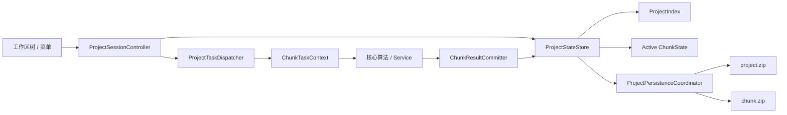

# PlaScan 多 Chunk 工作区设计方案

> 状态：一期实现中（存储、格式门禁、基本管理和工作区树已落地）
> 日期：2026-07-30
> 适用范围：`.plascan + .files` 工程格式、项目数据层、GUI 工作区、CLI 和后台任务

## 1. 结论

PlaScan 应引入与 Metashape 类似的 **Chunk（区块）**，但不只模仿工作区树的外观。
Chunk 应成为项目中的独立摄影测量处理单元：

- 一个项目包含一个或多个 Chunk。
- 每个 Chunk 独立拥有照片实例、相机与传感器状态、标记、坐标系、处理区域、工作流配置和成果。
- 每个 Chunk 的原始影像、参考数据和生成成果都进入自己的数字目录，不再使用根级
  `workspace/` 承载业务数据。
- 复制 Chunk 时可用硬链接、reflink 或按需复制降低重复占用，但不得让新 Chunk 的权威路径
  指向另一个 Chunk 的目录。
- 所有后台任务在启动时绑定明确的 `project_id + chunk_id + revision`，切换当前 Chunk 不改变任务归属。
- 跨 Chunk 对齐和合并是显式操作，不允许工作流隐式读取另一个 Chunk 的成果。

首期只实现“一项目多 Chunk、单个当前 Chunk、工作流完全隔离”。Frame、多 Chunk 并行编辑、
跨 Chunk 对齐和合并在数据格式中预留，但不与首期绑定。

## 2. 为什么需要 Chunk

当前工程以单套 `images` 和全局 `*_results` 数组表达处理状态，适合单场景顺序处理，但在以下
场景中边界不够清晰：

- 同一批影像需要使用不同相机模型、参数或掩膜进行对照处理。
- 一个任务包含不同轨道、不同时间、不同区域或不同传感器的数据。
- 用户希望保留一套稳定结果，同时复制数据尝试新的特征、匹配、MVS 或网格参数。
- 大项目需要按逻辑单元延迟加载和保存，避免任何小改动都刷新整个项目状态。
- 后台任务运行期间用户切换场景，结果必须仍写回任务启动时的处理单元。

Chunk 提供的是数据所有权、任务作用域和持久化边界，而不仅是树形界面上的一层目录。

## 3. 概念与边界

### 3.1 Chunk 是什么

一个 Chunk 表示可独立完成摄影测量主流程的数据集合：

```text
照片/传感器
    → 特征与匹配
    → 空三、相机位姿与连接点
    → 深度图与密集点云
    → 网格与纹理
    → DEM 与正射影像
```

Chunk 可以单独重命名、复制、处理、导出、归档或删除。两个 Chunk 即使引用同一批影像，
其相机参数、影像启用状态、掩膜、标记、处理参数和成果仍相互独立。

### 3.2 Chunk 不是什么

- 不是普通照片文件夹。照片组只负责分类，不隔离相机和成果。
- 不是 Frame。首期一个 Chunk 只有一套当前照片集合，暂不引入多 Frame 时间序列。
- 不是结果版本。一个 Chunk 内仍可有多个历史产物，并为每类成果指定当前版本。
- 不是进程或线程。Chunk 是持久化业务实体，任务只是以它为作用域。

### 3.3 所有权划分

| 数据 | 归属 | 说明 |
|---|---|---|
| 项目名称、项目 ID、Chunk 顺序 | 项目 | 打开项目时立即加载 |
| 默认 Chunk、最近活动 Chunk | 项目 | 默认值属于工程语义，最近活动值属于 UI 状态 |
| 原始影像文件 | Chunk | 打包后位于该 Chunk 数字目录；外部引用也登记在该 Chunk |
| 参考 DEM、LiDAR、控制文件原件 | Chunk | 文件、使用角色和处理参数均由该 Chunk 管理 |
| 照片启用状态、相机参数、掩膜 | Chunk | 同一影像在不同 Chunk 中可不同 |
| 标记、像点观测、比例尺 | Chunk | 坐标和观测依赖当前解算 |
| 坐标系、行星体、处理区域 | Chunk | 可从项目模板初始化，之后独立修改 |
| 特征、匹配、连接点、深度、点云 | Chunk | 严禁跨 Chunk 隐式复用 |
| 网格、纹理、DEM、DOM、质量报告 | Chunk | 记录输入成果和参数谱系 |
| CUDA/Python/模型搜索路径 | 应用 | 不写入 Chunk 的可移植资源路径 |

## 4. 用户界面

### 4.1 工作区树

工作区建议采用三层结构：

```text
工作区（2 个区块，36 张照片）
├─ 区块 1（16 张照片，4 个标记，1,670 个连接点） [当前]
│  ├─ 照片（16/16 已对齐）
│  ├─ 掩膜（16）
│  ├─ 标记（4）
│  ├─ 观测网络
│  ├─ 连接点（1,670）
│  ├─ 深度图
│  ├─ 稠密点云
│  ├─ 3D 模型
│  ├─ DEM
│  ├─ 正射影像
│  ├─ 参考数据
│  └─ 报告
└─ 区块 2（20 张照片，0 个标记，尚未对齐）
   └─ 照片（0/20 已对齐）
```

显示规则：

- 当前 Chunk 使用粗体和明确的“当前”标记，不仅依赖颜色。
- Chunk 摘要使用缓存计数，展开后再延迟加载详细节点。
- Chunk 名称允许重复，所有内部操作使用 UUID；名称重复时 UI 补充短 ID。
- 空分类默认隐藏；用户可在设置中选择“显示空分类”。
- 单击 Chunk 只选中并显示属性，双击或“设为当前区块”才切换，防止误触后启动到错误目标。

### 4.2 命令语义

项目级工具栏和菜单中的处理命令始终作用于**当前 Chunk**，标题或状态区应持续显示目标，
例如“生成密集点云 — 区块 2”。

Chunk 右键菜单首期提供：

- 设为当前区块
- 新建区块
- 重命名
- 复制区块
- 导出区块摘要
- 删除区块
- 属性

“复制区块”首期采用“复制元数据、不复制生成成果”的语义：

- 复制照片实例、相机初值、标记、坐标系、处理区域和配置。
- 默认不复制特征、匹配、点云、模型、DEM/DOM 等生成成果。
- 复制完成后生成新的 `chunk_id`，源 Chunk 不受后续修改影响。
- 对已打包的原始影像和参考资源，为新 Chunk 创建独立路径：文件系统支持时使用硬链接或
  reflink，不支持时执行普通复制；元数据不能跨 Chunk 引用源目录。

删除 Chunk 时必须：

1. 检查是否有运行中的任务。
2. 列出将删除的 Chunk 私有成果大小。
3. 只删除该 Chunk 对应的数字目录，不扫描或修改其他数字目录。
4. 至少保留一个 Chunk；最后一个 Chunk 只能“清空”，不能直接删除。

## 5. 数据模型

### 5.1 项目索引

项目索引只保存轻量摘要，不嵌入完整 Chunk 数据：

```json
{
  "schema_version": 1,
  "project_id": "project-uuid",
  "default_chunk_id": "chunk-uuid-1",
  "next_chunk_directory": 2,
  "chunks": [
    {
      "id": "chunk-uuid-1",
      "name": "区块 1",
      "order": 0,
      "directory": "1",
      "storage": "1/chunk.zip",
      "revision": 12,
      "summary": {
        "photo_count": 16,
        "aligned_photo_count": 16,
        "marker_count": 4,
        "tie_point_count": 1670
      }
    }
  ]
}
```

`summary` 是可重建缓存，不是权威业务数据。发现计数不一致时以 Chunk 内容为准并修复索引。

### 5.2 Chunk 元数据

每个 Chunk 具有稳定 ID、独立修订号和独立元数据：

```json
{
  "schema_version": 1,
  "chunk_id": "chunk-uuid-1",
  "name": "区块 1",
  "revision": 12,
  "created_at": "2026-07-30T10:00:00Z",
  "updated_at": "2026-07-30T11:00:00Z",
  "coordinate_system": {},
  "region": {},
  "images": [
    {
      "instance_id": "image-instance-uuid",
      "resource_id": "chunk-image-uuid",
      "enabled": true,
      "camera": {},
      "mask_uri": "plascan:///chunk/chunk-uuid-1/masks/image-instance-uuid.png"
    }
  ]
}
```

必须区分：

- `resource_id`：当前 Chunk 中的物理影像资源。
- `instance_id`：影像在某个 Chunk 中的逻辑实例。

相机、掩膜、分组、启用状态和观测都引用 `instance_id`。复制 Chunk 时，新目录可以通过
硬链接或 reflink 复用底层影像字节，但从工程模型看仍是两个独立资源，删除任一 Chunk 不会
使另一个 Chunk 出现悬空引用。

### 5.3 成果记录

现有各类 `*_results` 可在首期原样放入对应 Chunk，降低改造风险；新增和逐步改造的记录应
使用统一成果信封：

```json
{
  "artifact_id": "artifact-uuid",
  "type": "dense_cloud",
  "status": "ready",
  "active": true,
  "created_at": "2026-07-30T11:00:00Z",
  "producer": "mvs.fusion",
  "parameter_hash": "sha256:...",
  "input_artifact_ids": ["depth-artifact-uuid"],
  "input_chunk_revision": 11,
  "files": [
    {
      "role": "point_cloud",
      "uri": "plascan:///chunk/chunk-uuid-1/dense/artifact-uuid/cloud.ply"
    }
  ],
  "metrics": {
    "point_count": 1234567
  }
}
```

统一信封用于回答三个关键问题：成果属于哪个 Chunk、由什么输入生成、删除或重算会影响什么。
同类成果可保留多个版本，但任一类型最多只有一个 `active=true`。

## 6. 工程存储布局

当前 `E:/code/test/dino/dino.files` 的结构是 `project.zip + workspace/`。引入 Chunk 后，
根级 `workspace/` 应退出正式格式，改为由 `1/`、`2/`、`3/` 等数字目录直接承载各 Chunk
的全部内容：

```text
project.plascan
project.files/
├─ project.zip
│  └─ doc.json                     # 工程身份、Chunk 索引、UI 状态
├─ 1/
│  ├─ chunk.zip
│  │  └─ doc.json                  # Chunk 身份、核心、结果、配置、资源索引
│  ├─ resources/
│  │  ├─ images/<resource-id>/<filename>
│  │  └─ reference/<resource-id>/<filename>
│  ├─ masks/
│  ├─ features/
│  ├─ matches/
│  ├─ sfm/
│  ├─ mvs/
│  ├─ dense/
│  ├─ models/
│  ├─ terrain/
│  └─ reports/
├─ 2/
│  └─ ...                         # 第二个 Chunk 的完整内容
└─ 3/
   └─ ...                         # 第三个 Chunk 的完整内容
```

数字目录分配规则：

- 新工程的首个 Chunk 使用 `1/`，后续使用 `2/`、`3/`……。
- 目录名只允许不带前导零的正整数。
- 项目索引持久化单调递增的 `next_chunk_directory`。创建 Chunk 时使用该编号，并在创建事务
  中立即将其递增。
- 任何已分配过的数字目录都不能复用。删除 `2/` 后保留编号空洞，下一次创建使用 `4/`。
- 调整工作区显示顺序或重命名 Chunk 不改变其数字目录。
- 数字目录只是物理存储槽位，不能作为业务身份；根 `doc.json.chunk_index` 始终保存
  `chunk_id(UUID) → directory(number)` 映射。
- `next_chunk_directory` 缺失、倒退或损坏时拒绝打开工程；系统不会通过扫描现存目录猜测
  历史最大编号，避免误复用已经删除的目录号。

资源 URI 使用 Chunk UUID，而不是直接保存数字目录：

```text
plascan:///chunk/<chunk-id>/resources/images/<resource-id>/image.tif
plascan:///chunk/<chunk-id>/models/<artifact-id>/model.obj
```

解析器先在根 `doc.json.chunk_index` 中把 `chunk_id` 映射到数字目录。例如
`chunk-uuid-1 → 1` 后，第二条 URI 才解析为
`project.files/1/models/<artifact-id>/model.obj`。这样数字目录保持简单，同时不会进入业务
记录、任务参数或 UI 身份判断。

设计原则：

- `project.zip` 只负责项目索引、工程级配置和 UI 状态。
- `project.zip` 和 `chunk.zip` 均只保存一个权威 `doc.json`。
- Chunk 的导入资源和大型生成数据都直接进入对应数字目录，不再增加 `workspace/` 中间层。
- 保存一个 Chunk 不重写其他 Chunk 的 ZIP。
- 删除成果先更新该 Chunk 元数据，再清理同一数字目录中的无引用文件；异常中断时宁可留下
  孤儿文件，不可让仍被引用的文件丢失。
- 根目录除 `project.zip`、数字 Chunk 目录和明确的运行期锁文件外，不保存业务资源。

## 7. 运行时架构



建议新增或演进的职责：

| 组件 | 建议位置 | 职责 |
|---|---|---|
| `ProjectIndex`、`ChunkId`、`ChunkSummary` | `src/common/project` | 与 GUI 无关的格式和 DTO |
| `ChunkState`、`ChunkSnapshot` | `src/common/project` | 内存状态、revision、只读快照 |
| `ProjectStateStore` | `src/common/project` | Chunk 列表、当前 Chunk、变更信号 |
| `ChunkStore` | `src/gui/project/archive` | `chunk.zip` 读写、格式门禁和校验 |
| `ChunkResourceResolver` | `src/gui/project/archive` | 将 Chunk UUID URI 解析到对应数字目录 |
| `ProjectTreeModel` | `src/gui/widgets` | 将 Chunk 摘要和资源 DTO 转为树节点 |
| `ChunkTaskContext` | `src/gui/project/tasks` | 固化任务启动时的项目、Chunk 和 revision |
| `ChunkResultCommitter` | `src/gui/project/services` | 校验任务上下文并原子登记成果 |

`ProjectData` 作为项目会话模型，不应继续扩展新的全局结果接口。新代码直接按
`chunk_id` 访问项目状态，现有 `currentMeta()`、`getAllImages()` 等接口只服务当前 Chunk。

核心算法不依赖工程格式或 GUI，只接收显式输入 DTO、输出目录和取消/进度接口。

### 7.1 必要接口

```cpp
class ProjectStateStore
{
public:
    QList<ChunkSummary> chunks() const;
    QString activeChunkId() const;
    bool setActiveChunk(const QString &chunk_id, QString *error_message = nullptr);
    std::shared_ptr<const ChunkSnapshot> snapshot(
        const QString &chunk_id,
        QString *error_message = nullptr) const;
    bool applyMutation(const QString &chunk_id,
                       qint64 expected_revision,
                       const ChunkMutation &mutation,
                       QString *error_message = nullptr);
};
```

重要信号包括：

- `chunkAdded(chunk_id)`
- `chunkRemoved(chunk_id)`
- `chunkChanged(chunk_id, revision)`
- `activeChunkChanged(previous_id, current_id)`
- `projectSummaryChanged()`

Widget 只消费 DTO 和信号，不自行解析 ZIP 或业务 JSON。

## 8. 后台任务与一致性

每个任务启动时捕获不可变上下文：

```text
project_id
project_generation
chunk_id
chunk_revision
input image instance IDs
input artifact IDs
output staging directory
```

行为规则：

1. 切换当前 Chunk 不取消任务，也不改变结果归属。
2. 任务进度显示原始 Chunk 名称；用户可从任务状态跳转回该 Chunk。
3. 任务完成后只向原 `chunk_id` 提交结果。
4. 项目已关闭、generation 不匹配或 Chunk 已删除时，拒绝提交并保留可恢复的临时输出。
5. 输入 revision 已变化时，根据工作流策略拒绝提交或将成果标记为 `stale`，不得静默覆盖。
6. 同一 Chunk 首期只允许一个会修改主链状态的长任务；不同 Chunk 仍可先采用全局串行队列，
   后续再按 CPU/GPU/IO 资源配额开放并行。
7. 有运行中任务的 Chunk 不允许删除；复制操作只能基于已提交 revision。

推荐提交顺序：

1. 写入 `<numbered-chunk-dir>/.plascan_tmp/<task-id>/`。
2. 校验输出完整性。
3. 将输出移动到正式成果目录。
4. 原子替换 `chunk.zip`。
5. 更新 `project.zip` 中的 Chunk 摘要。

如果第 5 步失败，重新打开项目时可从 `chunk.zip` 修复摘要；不得因摘要写入失败删除有效成果。

## 9. 跨 Chunk 操作

跨 Chunk 能力分阶段实现：

### 9.1 对齐 Chunk

对齐结果保存为项目级 `ChunkTransform`，记录源、目标、算法、控制点、变换矩阵、精度和输入
revision。默认不直接改写任一 Chunk 的相机或点云坐标。

### 9.2 合并 Chunk

合并应创建新 Chunk，源 Chunk 保持不变。合并向导必须显式处理：

- 重复影像资源和不同影像实例。
- 传感器/相机模型冲突。
- 同名标记和控制点冲突。
- 坐标系与行星体不一致。
- 当前成果选择与坐标变换。

首期不提供“原地合并”，以避免不可逆的数据覆盖。

## 10. 旧项目策略

不提供内置迁移。旧版单体 `.plascan` ZIP、根级 `workspace/` 分体工程或 manifest
版本不匹配的工程都直接拒绝打开：

- 只读取描述文件和 manifest 以识别格式，不加载业务数据。
- 不创建 `1/`，不生成 Chunk UUID 或根 `doc.json`。
- 不改写 `project.zip`，不复制、移动或删除旧资源。
- 错误信息明确提示“旧版工程不受支持”，建议新建 Chunk 工程后重新导入。
- 如未来确有迁移需求，使用独立、显式执行的转换工具，不能放入正常打开流程。
- 新版工程也必须被旧版程序明确拒绝，不能只显示第一个 Chunk 后继续保存。

## 11. 分阶段实施

### 阶段 0：固化格式和行为

- 定义 `ChunkId`、`ChunkSummary`、`ChunkSnapshot` 和 JSON schema。
- 增加旧工程拒绝且原文件不变、中文名称/路径、损坏 Chunk 隔离测试。
- 确定 Chunk 私有资源索引、硬链接/reflink 复制和资源清理规则。

### 阶段 1：数据层和存储

- 引入 `ProjectIndex`、`ProjectStateStore` 和 `ChunkStore`。
- 新建项目自动创建“区块 1”。
- 只读写当前 Chunk 格式，旧工程在格式门禁处直接拒绝。
- 保存时只重写有修改的 Chunk。

### 阶段 2：当前 Chunk 兼容接入

- `ProjectData` 和 `ProjectManager` 的旧接口代理当前 Chunk。
- 所有工作流请求增加 `chunk_id`，所有结果记录明确写回目标 Chunk。
- 项目切换和 Chunk 切换统一使用 generation/revision 防止过期回调。

### 阶段 3：工作区 GUI

- 将 `DataTreeWidget` 的 JSON 解释迁入 `ProjectTreeModel`。
- 增加项目根、Chunk 节点、当前标记、摘要和右键命令。
- Chunk 切换统一刷新照片条、属性、二维/三维视图和动作状态。
- 保存和恢复展开状态、最近活动 Chunk。

### 阶段 4：Chunk 管理

- 新建、重命名、元数据复制、删除、导出摘要。
- 增加 Chunk 内资源索引检查和显式垃圾回收。
- CLI 增加 `--chunk <id|name>`；名称不唯一时报错，未指定时使用默认 Chunk。

### 阶段 5：高级能力

- Chunk 对齐、变换查看和误差报告。
- 以“创建新 Chunk”方式合并。
- 在任务调度器具备资源配额后开放不同 Chunk 并行处理。
- 根据实际需求再决定是否引入 Frame。

## 12. 验收标准

### 数据隔离

- 在区块 A 添加、删除照片或修改相机，不改变区块 B。
- 每个 Chunk 的权威文件路径都位于自己的数字目录；复制时即使使用硬链接或 reflink，也不
  出现跨 Chunk 路径引用。
- 在区块 A 生成的新成果只出现在区块 A。
- 删除区块 A 只删除它映射的数字目录，不修改区块 B。

### 任务安全

- 在区块 A 启动 MVS 后切换到区块 B，结果仍登记到 A。
- 任务运行时关闭项目，旧回调不能污染随后打开的项目。
- 输入 revision 改变后，旧任务结果不会覆盖新状态。
- 运行中 Chunk 无法被直接删除。

### 持久化

- 保存、关闭、重开后 Chunk 顺序、默认/最近活动 Chunk 和成果保持一致。
- 只修改一个 Chunk 时不重写其他 Chunk 的元数据包。
- 单个 `chunk.zip` 损坏时，项目仍能列出并打开其他健康 Chunk，并明确标记故障项。
- 新建三个 Chunk 后出现 `1/`、`2/`、`3/`；删除 `2/` 后不重排 `3/`，再次新建必须使用
  `4/`，不得复用 `2/`。
- 新版工程根目录不存在业务 `workspace/`；检测到旧根工作区时直接拒绝且不修改内容。
- 中文项目路径、中文 Chunk 名称和跨平台移动保持可用。

### 格式门禁

- 旧单 Chunk、根级 `workspace/` 和旧单体工程均明确拒绝。
- 拒绝后旧描述文件、归档和资源字节保持不变。
- GUI 和 CLI 的工程入口均执行相同的当前格式校验。
- 多 Chunk 工程不会被旧版程序静默降级保存。

### 性能

- 打开项目只加载项目索引和 Chunk 摘要。
- 仅当前或用户展开的 Chunk 加载详细元数据。
- 大型成果不进入 `project.zip` 或 `chunk.zip`。
- Chunk 切换不在 GUI 线程读取 ZIP、影像、点云、GDAL 栅格或模型文件。

## 13. 首期不做

- 不实现 Metashape 的全部内部格式或脚本 API。
- 不引入多 Frame 动画或时间序列。
- 不允许成果在 Chunk 间建立隐式路径依赖。
- 不做原地 Chunk 合并。
- 不默认复制大型生成成果。
- 不在引入 Chunk 的同时重写摄影测量算法。

## 14. 推荐决策

建议按“数据边界先于界面”的顺序实施：

1. 先完成项目索引、Chunk 存储和任务作用域。
2. 再让现有单项目 API 代理当前 Chunk，保持现有流程可运行。
3. 最后上线多 Chunk 工作区树和管理命令。

如果先把当前全局 JSON 套上一层 Chunk 树节点，后台任务、资源删除和结果登记仍然没有隔离，
后续会产生比当前更隐蔽的数据串写问题。首期成功的判断标准不是“界面能显示多个 Chunk”，
而是“无论用户怎样切换 Chunk，任何数据和任务都不会写错归属”。
