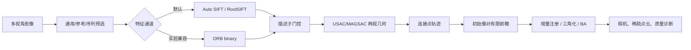

# Metashape 对齐照片 clean-room 兼容实现报告

> 日期：2026-08-27
> 类型：普通逆向与兼容实现（`flavor = null`）
> 目标：在 PlaScan 中实现可运行、可标定的对齐照片工作流兼容层

> 后续状态（2026-09-04）：本报告记录的是当时的实验。`orb_binary` 后来被 PlaMatch-HCT 与统一 coarse
> 预选链替代，现已从产品源码、注册表、GUI 和 CLI 删除；下文保留为历史验证记录。

## 执行摘要

PlaScan 已具备候选像对生成、特征匹配、两视几何、连接点轨迹、初始像对选择、增量相机注册、
三角化和 bundle adjustment 的完整链路。本次在该链路上新增 `orb_binary` 二进制兼容通道，复用了
逆向证据确认的二进制距离、top-2、ratio 和 mutual 门控结构，并把算法接入缓存、GUI 和相关 CLI。
默认生产路径仍为 `auto_sift`。受影响目标已在 Windows/MSVC Release 构建中通过，最终相关测试集
22/22 通过。

当前成果可以称为阶段和可观测行为兼容，不能称为 Metashape 2.3.1 私有实现的逐代码复刻或逐结果相同。
原因是静态证据无法恢复精确 MLDB 位布局、全部隐藏阈值、随机采样顺序及 BA 求解器细节。

更完整的逐阶段实现表、命令和标定建议见 [implementation-status.md](./implementation-status.md)，
算法/参数逆向依据见 [metashape-align-photos-analysis.md](./metashape-align-photos-analysis.md) 与
[parameter-reference.md](./parameter-reference.md)。

## 范围与授权

- Case scope：[scope.md](local-evidence.md)。
- 授权：用户自有离线样本与本地工程。
- 网络模式：offline。
- 本次只复用既有静态分析并修改 PlaScan 源码；没有运行、注入、修改目标程序，也没有许可证绕过或
  私有代码复制。

## 实现调用流



完整源见 [implementation-flow.mmd](./implementation-flow.mmd)。

## Evidence

| E-id | 来源 | 复现命令 | 哈希 | 支撑结论 |
|---|---|---|---|---|
| [E-001](local-evidence.md) | 既有逆向报告与源码审计 | `rg -n "MatchPhotos|resection|triangulation|bundle adjustment" docs/reverse_metashape src/core/matchphototask src/core/sfm` | n/a | 对齐阶段可映射到现有 PlaScan 主链 |
| [E-002](local-evidence.md) | MSVC Release 构建 | `cmake --build --preset windows-source-release --target ...` | n/a | 二进制通道、CLI 与 GUI 可构建 |
| [E-003](local-evidence.md) | CTest | `python scripts/env/run_tests.py --test-dir build/windows-source-release ...` | n/a | 17/17 相关测试通过 |
| [E-004](local-evidence.md) | 最终 CTest | `python scripts/env/run_tests.py --test-dir build/windows-source-release ...` | n/a | 含 CLI 合同的 22/22 测试通过 |

## Findings

### F-001：完整工作流骨架已存在

- severity: `n/a_re`
- category: `reverse_algo`
- status: `validated`
- evidence_ids: `[E-001, E-003, E-004]`
- confidence: `high`
- location: `src/core/matchphototask`、`src/core/sfm`

PlaScan 已覆盖从候选像对到增量 BA 的完整 clean-room 工作流，新增描述子无需把算法分支扩散到 SfM。

### F-002：二进制兼容通道已可运行

- severity: `n/a_re`
- category: `reverse_algo`
- status: `validated`
- evidence_ids: `[E-002, E-003, E-004]`
- confidence: `high`
- location: `src/core/image_matching/orb_binary`、`src/core/matchphototask`

`orb_binary` 产生 `CV_8U` 描述子并执行 Hamming top-2、ratio 与 mutual gate；统一算法 ID、版本和实现
指纹将其缓存与 Auto SIFT 隔离。GUI 注册表和相关 CLI 均可以显式选择该通道。

### F-003：精确私有等价仍不可验证

- severity: `n/a_re`
- category: `reverse_algo`
- status: `candidate`
- evidence_ids: `[E-001]`
- confidence: `high`
- location: [implementation-status.md](./implementation-status.md)

目标的私有 MLDB 位布局、内部阈值、随机过程和 BA 数值实现仍未知。因此不应宣称逐阈值、逐浮点、
逐字节或逐点云相同；后续应在授权数据上按漏斗阶段标定。

## Path

### P-001：对齐照片 clean-room 调用路径

- path_type: `callflow`
- start: 多视角影像与可选参考位姿
- goal: 已对齐相机、稀疏点云和质量诊断

1. 通用/参考/序列预选生成候选像对（E-001，F-001）。
2. Auto SIFT 或 `orb_binary` 提取特征并执行描述子门控（E-002，F-002）。
3. 两视几何验证并构建多视图连接点轨迹（E-001，F-001）。
4. 初始像对有限前瞻、增量 resection、三角化与 BA（E-001，F-001）。
5. 运行匹配、CLI、GUI 与 SfM 回归确认主链没有退化（E-003/E-004，F-001/F-002）。

Residual risks：私有 MLDB 位布局、内部阈值、随机采样顺序以及 BA 鲁棒核/线性求解器未知。

## 验证与复现

```powershell
cmake --build --preset windows-source-release --target `
  test_orb_binary test_image_matching_registry test_match_photos_task `
  feature_match_cli match_photos_cli aerial_triangulation_cli plascan_gui test_workflow_cli

python scripts/env/run_tests.py `
  --test-dir build/windows-source-release `
  --output-on-failure `
  -R "WorkflowSettingsDialogTest|OrbBinaryTest|ImageMatchingRegistryTest|MatchPhotosTaskTest|AutoSiftTest|SfmPipelineTest"
```

最终验证同时覆盖 `MatchPhotosCliGTest`、`FeatureMatchCliGTest` 和
`PhotogrammetryWorkflowCliGTest`。

## Timeline 摘要

完整追加记录见 [timeline.md](local-evidence.md)：

1. 建立 offline scope 并限制为静态复用和 clean-room 实现。
2. 对照逆向阶段与现有 MatchPhotos/SfM 主链。
3. 因当前 OpenCV 5 不提供 AKAZE/KAZE，采用名称准确的 `orb_binary` 基线。
4. 构建算法、任务、CLI 和 GUI，执行相关回归。
5. 生成正式报告、流程图和 case Evidence 链。

## 遗留问题与下一步

要把“高度行为兼容”提升为可量化结论，需要用户提供有权处理的固定影像及对应 Metashape 导出统计，
逐档比较候选像对、关键点、原始匹配、几何内点、轨迹、注册率、重投影误差和运行时间。验收应以这些
工程指标的允许区间为合同，而非要求不同实现产生逐字节相同稀疏点云。
