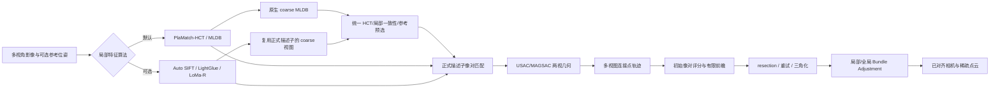

# “对齐照片”clean-room 复刻状态

## 结论

PlaScan 目前已经具备一个完整、可运行的“对齐照片”工作流：候选像对生成、局部特征提取与匹配、
两视几何验证、连接点轨迹构建、初始像对选择、增量相机注册、重三角化和 bundle adjustment 均有
对应实现。该实现以公开摄影测量算法、PlaScan 自有代码和静态逆向所得的阶段/参数证据为依据，
没有复制 Metashape 源代码，也不依赖运行、注入或修改 Metashape。

这里的目标是工作流和可观测行为兼容，不宣称逐指令、逐阈值或逐浮点结果与 Metashape 2.3.1
完全相同。静态证据尚不能恢复私有描述子位布局、全部隐藏阈值、随机采样顺序、PnP/BA 求解器细节；
在这些未知量没有通过授权黑盒数据标定前，“一模一样”无法验证。

## 当前实现覆盖

完整可编辑源文件见 [implementation-flow.mmd](./implementation-flow.mmd)。

| 对齐阶段 | PlaScan 实现 | 当前状态 | 等价边界 |
|---|---|---|---|
| 质量档与关键点预算 | `MatchPhotosAlgorithmSelector` | 已实现 | 采用 PlaScan 可解释预设，不声称数值等于 Metashape |
| 通用预选 | HCT 候选、局部一致性、骨架森林 | 已实现 | PlaMatch 使用原生 coarse；浮点算法复用正式描述子生成 coarse 视图 |
| 参考预选 | 参考位姿/序列约束 | 已实现 | 支持 source/estimated/sequence 语义 |
| PlaMatch-HCT 局部特征 | LoG / MLDB、CPU HCTree、CUDA/OpenCL | 已实现、默认 | 使用用户自有且已验证的算法实现 |
| 浮点局部特征 | Auto SIFT / RootSIFT，多 CPU/GPU 后端 | 已实现、可选 | 与逆向中的 DoG/LoG 谱系相容，不等于私有 detector |
| 描述子候选过滤 | top-2、ratio、双向 mutual | 已实现 | 阈值由 PlaScan 参数控制 |
| 两视几何 | USAC/MAGSAC、F/H 模型与退化判断 | 已实现 | 求解器不宣称与目标内部实现相同 |
| 引导重匹配 | 基础矩阵引导和二次过滤 | 已实现（Auto SIFT） | 仅对算法声明支持的浮点特征启用 |
| 连接点轨迹 | 多视图 track 合并、筛选和统计 | 已实现 | 轨迹约束可观测，内部排序可能不同 |
| 初始像对 | 候选评分与有限前瞻 | 已实现 | 已保留诊断；私有评分常数未知 |
| 增量注册 | resection、失败重试、模型增长 | 已实现 | PnP 最小解/采样顺序未知 |
| 三角化与 BA | 双视/三视三角化、阶段化全局 BA | 已实现 | 已恢复 20/10 次预算、五轮刷新和净增量/3σ 条件；私有稀疏库实现不作为产品依赖 |
| 匹配漏斗诊断 | pair/match/inlier/guided/track 结构化统计 | 已实现 | 用于与授权基准结果逐阶段标定 |

## 当前算法范围

生产默认算法为 `plamatch_hct`，可选算法为 `auto_sift`、`sift_lightglue` 和 `loma_r`。此前的
`orb_binary` 仅是 2026-08-27 加入的实验兼容基线；在用户确认没有保留必要后，现已从实现、注册表、
GUI、CLI 和当前文档中移除。历史实施报告保留当时事实，并已标注后续状态。

## 已验证内容
## 已验证内容

- MSVC Release 构建：`image_matching`、`matchphototask`、三个匹配/空三 CLI、`plascan_gui`。
- `OrbBinaryTest`：真实提取产生一致的 `CV_8U` 描述子；Hamming ratio/mutual 门控符合预期。
- `ImageMatchingRegistryTest`：算法 ID、版本和 CPU 能力正确注册。
- `MatchPhotosTaskTest`、`AutoSiftTest`：默认生产路径及任务编排没有回归。
- `SfmPipelineTest`：三影像增量注册、初始像对顺序、失败重试和进度/取消行为通过。
- `WorkflowSettingsDialogTest`：GUI 算法资源设置行为通过。
- CLI 合同：`MatchPhotosCliGTest`、`FeatureMatchCliGTest` 和 `PhotogrammetryWorkflowCliGTest` 通过。
- 最终定向集合共 22/22 测试通过。

## 要达到可验证的高度一致还缺什么

下一阶段需要一组用户有权处理的固定影像和对应 Metashape 输出，至少采集每个质量档的候选像对数、
关键点数、原始匹配数、几何内点数、轨迹数、已对齐相机数、重投影误差和运行时间。利用现有
`matching_funnel` 逐级对比，可以判断差异来自预选、描述子召回、几何门控还是 SfM 注册。

即使完成标定，合理的验收标准也应是相机注册率、轨迹质量、重投影误差和产物几何的一致区间，
而不是要求两套不同实现输出逐字节相同的稀疏点云。
