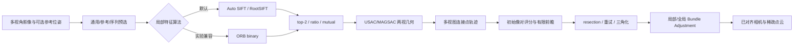

# “对齐照片”clean-room 复刻状态

## 结论

PlaScan 目前已经具备一个完整、可运行的“对齐照片”工作流：候选像对生成、局部特征提取与匹配、
两视几何验证、连接点轨迹构建、初始像对选择、增量相机注册、重三角化和 bundle adjustment 均有
对应实现。该实现以公开摄影测量算法、PlaScan 自有代码和静态逆向所得的阶段/参数证据为依据，
没有复制 Metashape 源代码，也不依赖运行、注入或修改 Metashape。

这里的目标是工作流和可观测行为兼容，不宣称逐指令、逐阈值或逐浮点结果与 Metashape 2.3.1
完全相同。静态证据尚不能恢复私有描述子位布局、全部隐藏阈值、随机采样顺序、PnP/BA 求解器细节；
在这些未知量没有通过授权黑盒数据标定前，“一模一样”无法验证。

## 当前实现覆盖



完整可编辑源文件见 [implementation-flow.mmd](./implementation-flow.mmd)。

| 对齐阶段 | PlaScan 实现 | 当前状态 | 等价边界 |
|---|---|---|---|
| 质量档与关键点预算 | `MatchPhotosAlgorithmSelector` | 已实现 | 采用 PlaScan 可解释预设，不声称数值等于 Metashape |
| 通用预选 | 词汇检索、候选上限和图邻接 | 已实现 | 算法作用和缩减漏斗一致，词汇训练细节不同 |
| 参考预选 | 参考位姿/序列约束 | 已实现 | 支持 source/estimated/sequence 语义 |
| 浮点局部特征 | Auto SIFT / RootSIFT，多 CPU/GPU 后端 | 已实现、默认 | 与逆向中的 DoG/LoG 谱系相容，不等于私有 detector |
| 二进制局部特征 | `orb_binary` | 本次新增、可选 | 复刻二进制通道接口与匹配门控；不是私有 MLDB 位布局 |
| 描述子候选过滤 | top-2、ratio、双向 mutual | 已实现 | 阈值由 PlaScan 参数控制 |
| 两视几何 | USAC/MAGSAC、F/H 模型与退化判断 | 已实现 | 求解器不宣称与目标内部实现相同 |
| 引导重匹配 | 基础矩阵引导和二次过滤 | 已实现（Auto SIFT） | `orb_binary` 暂不进入 SIFT 专用 guided rematch |
| 连接点轨迹 | 多视图 track 合并、筛选和统计 | 已实现 | 轨迹约束可观测，内部排序可能不同 |
| 初始像对 | 候选评分与有限前瞻 | 已实现 | 已保留诊断；私有评分常数未知 |
| 增量注册 | resection、失败重试、模型增长 | 已实现 | PnP 最小解/采样顺序未知 |
| 三角化与 BA | 双视/三视三角化、异常轨迹修复、局部/全局 BA | 已实现 | 鲁棒核、线性求解器和精确调度未知 |
| 匹配漏斗诊断 | pair/match/inlier/guided/track 结构化统计 | 已实现 | 用于与授权基准结果逐阶段标定 |

## 本次新增的二进制兼容通道

算法 ID 为 `orb_binary`，由统一 `ImageMatchingRegistry` 注册，因此 GUI 的“匹配算法”列表会自动显示，
`feature_match_cli`、`match_photos_cli`、`aerial_triangulation_cli` 和重建工作流 CLI 也可以选择。

实现行为：

1. 使用当前项目 OpenCV 5 依赖提供的 ORB 生成 `CV_8U` 二进制描述子。
2. 按响应稳定排序并应用统一关键点上限，坐标映射回原始影像尺度。
3. 对两个方向分别执行 Hamming top-2 搜索。
4. 依次应用 ratio 和 mutual gate，再输出统一 `MatchResult`。
5. 最终像对仍进入现有几何验证、轨迹构建和增量 SfM。
6. 通用预选仅为词汇粗检索把字节描述子临时映射到 `[0,1]` 浮点向量；最终匹配不改变 Hamming 度量。
7. 算法 ID、版本、参数指纹和内置实现指纹参与 `.pimatch` 缓存隔离，不会复用 Auto SIFT 的旧结果。

当前依赖没有提供 AKAZE/KAZE 类，因此没有使用“AKAZE/M-LDB”这一容易误导的名称。逆向证据已经明确
目标前端包含 Gaussian/DoG/LoG 与 MLDB 类通道，但这不足以证明它等于标准 AKAZE。

## 使用方式

GUI：在工作流设置的“匹配算法”中选择“ORB（二进制兼容基线）”。

双影像验证示例：

```powershell
build\windows-source-release\bin\feature_match_cli.exe `
  --left <left-image> --right <right-image> `
  --output-dir <match-output> `
  --algorithm-id orb_binary --device cpu
```

批量匹配或空三使用相同的算法 ID：

```text
match_photos_cli --algorithm-id orb_binary --device cpu ...
aerial_triangulation_cli --algorithm-id orb_binary --device cpu ...
```

`orb_binary` 是实验兼容基线；生产默认值仍为 `auto_sift`。

## 已验证内容

- MSVC Release 构建：`image_matching`、`matchphototask`、三个匹配/空三 CLI、`plascan_gui`。
- `OrbBinaryTest`：真实提取产生一致的 `CV_8U` 描述子；Hamming ratio/mutual 门控符合预期。
- `ImageMatchingRegistryTest`：算法 ID、版本和 CPU 能力正确注册。
- `MatchPhotosTaskTest`、`AutoSiftTest`：默认生产路径及任务编排没有回归。
- `SfmPipelineTest`：三影像增量注册、初始像对顺序、失败重试和进度/取消行为通过。
- `WorkflowSettingsDialogTest`：GUI 算法资源设置行为通过。
- CLI 合同：`MatchPhotosCliGTest`、`FeatureMatchCliGTest` 和 `PhotogrammetryWorkflowCliGTest` 通过。
- 最终定向集合共 22/22 测试通过。

## 要达到可验证的高度一致还缺什么

下一阶段需要一组用户有权处理的固定影像和对应 Metashape 输出，至少采集每个质量档的候选像对数、
关键点数、原始匹配数、几何内点数、轨迹数、已对齐相机数、重投影误差和运行时间。利用现有
`matching_funnel` 逐级对比，可以判断差异来自预选、描述子召回、几何门控还是 SfM 注册。

即使完成标定，合理的验收标准也应是相机注册率、轨迹质量、重投影误差和产物几何的一致区间，
而不是要求两套不同实现输出逐字节相同的稀疏点云。
