# Metashape 2.3.1 “对齐照片”内部算法与参数分析

> 分析日期：2026-08-27
>
> 报告类型：普通 PE 算法逆向，`flavor = null`
>
> 方法：授权离线静态分析、Ghidra 12.1.3、PE/CUDA 字符串取证、Agisoft 2.3.1 官方资料和原始论文交叉核对
>
> 边界：未运行、注入、修改或联网驱动 Metashape，也未进行许可证绕过

## 1. 执行摘要

Metashape 的“对齐照片”不是一个单一求解器，而是 `MatchPhotos` 与 `AlignCameras` 两段可缓存、可分块的流水线。前端先按精度构建影像尺度层，检测并描述关键点，通过通用/参考预选减少像对，再执行描述子候选搜索、匹配过滤与可选 guided second pass，最后将对应合并为 tie-point tracks。后端从多个候选中评估双相机初始模型，循环用已有 3D–2D 对应 resection 新相机，执行双视/三视三角化、退化候选重三角化和反复 bundle adjustment。

静态证据确认二进制内嵌 Gaussian/DoG/LoG、方向估计和 MLDB 提取/比较 CUDA kernel；因此最准确的描述是“Agisoft 自有的 LoG/DoG 多尺度 detector + MLDB 类二进制 descriptor”，而不是标准 AKAZE。匹配层同时存在 `KDTree/RKDTree` 与 `ntrees/neighbour_checks` 配置，以及独立的 GPU 二进制比较路径，说明不同描述子通道采用不同候选搜索实现。当前证据能恢复算法族和主控制流，但不能确认精确描述子位布局、距离/ratio 阈值、几何估计器、PnP 最小解、BA 鲁棒核或线性求解器。

## 2. 范围、样本与证据强度

授权和操作边界见 [scope.md](local-evidence.md)。本次只对用户本机离线样本进行静态读取；公开网络仅用于核对 Agisoft 文档和原始论文。

| 属性 | 值 |
|---|---|
| 样本 | `D:\metashape2.3.1\metashape.exe` |
| 产品 | Agisoft Metashape Professional 2.3.1 |
| 文件类型 | PE32+ x86-64 |
| 大小 | 131,672,960 bytes |
| SHA-256 | `457BC052641A52C938CBED51C98E927A1C9120A7694F7CCF0E2F1E942B5F3E50` |
| Authenticode | Valid；签名者 `AGISOFT LLC` |
| 关键节 | `.text`, `.rdata`, `.data`, `.nv_fatb`, `.nvFatBi` |
| 关键导入 | Qt5、OpenBLAS、ONNX Runtime、OpenMP `VCOMP140`、Python 3.12、OpenGL |
| Ghidra 基址 | `0x140000000` |

本文使用以下置信度口径：

- 确认：官方契约与直接二进制证据一致，或清晰控制流/RTTI/kernel 多点互证。
- 高置信推断：多个静态线索指向同一算法族，但缺少运行时输入输出或完整类型恢复。
- 未知：只有配置名、日志名或行业常见做法，不能恢复精确数学形式。

## 3. 总体工作流

```mermaid
flowchart LR
    images["输入影像、掩膜和参考元数据"] --> scale["精度/downscale 与影像金字塔"]
    scale --> detect["Gaussian/DoG/LoG 关键点检测"]
    detect --> describe["方向估计与 MLDB 类描述子"]
    describe --> preselect["Generic / Reference 像对预选"]
    preselect --> search["KD/RKDTree ANN 或 GPU 二进制比较"]
    search --> verify["匹配过滤与几何引导补匹配"]
    verify --> tracks["KeypointMatches / TiePointsCache"]
    tracks --> seed["evaluateInitialPair 双相机种子"]
    seed --> register["循环 resection 注册新相机"]
    register --> triangulate["双视/三视三角化与 RANSAC 重三角化"]
    triangulate --> ba["Bundle adjustment 与 adaptive fitting"]
    ba --> register
    ba --> result["相机 EO/IO 与 tie-point cloud"]
```

RTTI 中同时存在 `TaskMatchPhotosParams`、`TaskAlignCamerasParams`、`TaskMatchPhotos` 和 `TaskAlignCameras`，并有 `Keypoints`、`KeypointMatches`、`TiePointsCache` 等对象。这个分层表明“检测/匹配缓存”和“相机几何解算”拥有不同生命周期，支持增量重试、网络分块和只重跑后端。

## 4. MatchPhotos：特征与匹配前端

### 4.1 精度与尺度输入

`MatchPhotos/downscale` 是前端影像尺度参数。2.3.1 API 中 `0/1/2/4/8` 分别对应 Highest/High/Medium/Low/Lowest；High 使用原始分辨率，Medium/Low/Lowest 的边长分别缩小 2/4/8 倍，Highest 对边长放大 2 倍。它直接改变检测定位、可用纹理、关键点数量和内存，并不会直接选择 BA 求解器。

内部配置迁移函数 `FUN_140176690`（`0x140176690`）把 `main/match_*` 旧键映射到 `MatchPhotos/*` 与 `AlignCameras/*` 新键。GUI 参数装配函数 `FUN_1414b10e0`（`0x1414b10e0`）读取 downscale、关键点/连接点上限、guided matching 和 adaptive fitting 等 QVariant，说明 GUI 显示值最终进入两个任务对象，而不是只保存在界面层。

### 4.2 多尺度检测、方向和描述子

`.nv_fatb` 与字符串 xref 中出现：

- `gpu::log_locate_points_device`
- `compute_dog_sigma_3_0_*`、`apply_dog_filter`
- Gaussian 5×5 sigma 1 与 11×11 sigma 3 kernel
- `gpu::get_orientation_hist_device`、`gpu::get_orientation_device`
- `gpu::mldb_extract_values_device`、`gpu::mldb_compare_values_device`
- `mldb_pairs[4032]`

对应的直接函数锚点包括 `0x1423ef5d0`、`0x142404720` 和 `0x142405110`。这些证据支持如下高置信数据流：

1. 在 downscale 后影像上构造若干 Gaussian/DoG/LoG 尺度层。
2. 定位空间—尺度响应极值并形成关键点。
3. 统计邻域方向响应并分配主方向。
4. 对局部强度/梯度聚合值做预定义成对比较，形成 MLDB 类二进制描述子。
5. 使用 GPU kernel 批量比较二进制描述子。

MLDB 是描述子谱系，不足以把检测器称为 AKAZE。标准 AKAZE 的检测建立在非线性扩散尺度空间上，而本样本明确暴露 Gaussian/DoG/LoG 路径；更可能是 Agisoft 自行组合经典公开原语并设计采样对、阈值、内存布局和 GPU 调度。

### 4.3 像对预选

匹配前至少有两类候选裁剪：

- Generic preselection：先以更低精度匹配照片，召回疑似重叠像对。
- Reference preselection：使用 Source、Estimated 或 Sequential 先验进一步选择候选。

二进制还保留 `generic_preselection_limit`、`generic_preselection_level`、`generic_preselection_reduce` 与 `reference_preselection_neighbors`。这些键说明预选不仅是布尔开关，还具有低精度层级、削减和邻居预算；但精确评分函数与默认值没有从当前静态证据恢复。

### 4.4 描述子搜索和匹配过滤

`feat::KDTree`、`feat::RKDTree` RTTI 与 `MatchPhotos/ntrees`、`MatchPhotos/neighbour_checks` 同时存在，高度符合 randomized KD-forest ANN 的参数语义：树数控制索引多样性/内存，检查预算控制查询召回与耗时。二进制 MLDB 另有 `gpu::KeypointMatcher` 和 `mldb_compare_values_device`，因此不能声称所有 descriptor mode 都走 float KD-tree。

`filter_matches` 与 `filter_weak_points` 能确认有匹配/弱点质量门，但不能据名称推断它使用 Lowe ratio、USAC、MAGSAC 或特定距离阈值。`descriptor_type` 和 `descriptor_version` 被写入任务/工程元数据，表明描述子类型与版本参与缓存兼容或重算判断。

### 4.5 Guided image matching

`FUN_141cf1cd0`（`0x141cf1cd0`）是当前最清晰的 guided second-pass 锚点。反编译显示它：

- 拒绝 `max_candidates == 0`；
- 构建受限制的 query/train 候选数组；
- 调用 OpenMP/GPU helper 批量处理；
- 校验返回数组长度；
- 输出新增索引对与轨迹记录。

这与官方说明一致：先充分匹配一小部分点，以它们建立的关系引导剩余高密度点。`keypoint_limit_per_mpx` 决定总检测预算，`guided_matching_neighbors`/`max_candidates` 决定局部候选宽度。能确认的是“受几何或已有匹配引导的候选限制”，不能确认首轮使用 F、E、H 中哪一种几何模型。

### 4.6 掩膜、stationary filter 与轨迹缓存

`filter_mask` 在检测前排除掩膜像素；`mask_tiepoints` 在跨图对应形成后排除相关轨迹，后一种语义可将一张图的掩膜传播到同一 3D 候选在其它图上的投影。`filter_stationary_points` 删除在不同影像中长期停留于相同像素位置的匹配，可抑制固定相机背景、传感器污点或镜头伪影。

`KeypointMatches` 与 `TiePointsCache` 表明 pair matches 会进一步合并为多视 track，并以独立于相机对齐的形式缓存。`keep_keypoints`、`reset_matches`、`workitem_size_cameras`、`workitem_size_pairs` 和 `subdivide_task` 共同定义前端缓存、分块和失败恢复边界。

## 5. AlignCameras：增量 SfM 与 BA

### 5.1 初始像对不是“匹配最多即选中”

`Block::align` 主函数 `FUN_1431e1080`（`0x1431e1080`）包含 `two cameras`、`before resection` 和 `after resection` 日志锚点。`evaluateInitialPair` 对应 `FUN_1431ed310`（`0x1431ed310`），其控制流会建立双相机候选、执行优化并尝试 resection 更多相机，再形成候选质量。

因此初始像对选择带有有限前瞻：除了两视支持和误差，还考虑该 seed 能否把更多 view graph 注册进来。具体评分权重、退化模型和尝试上限仍未知。

### 5.2 Resection 新相机

在摄影测量语境中，resection 用已有 3D tie points 与当前图像 2D 观测求相机外方位，属于 PnP 家族。静态控制流确认它在 BA 之间反复发生，但没有足够证据区分 P3P、EPnP、迭代 PnP 或具体 RANSAC 采样器。

### 5.3 三角化与退化恢复

`FUN_1420b2370`（`0x1420b2370`）引用 `Triangulating triplets...`，`FUN_1420a2de0`（`0x1420a2de0`）引用 `retriangulateCollapsedCandidatesRansac`。这表明系统不仅逐对三角化，还利用三视轨迹，并对塌缩/退化候选执行鲁棒重三角化。

能确认的是多视恢复和异常候选重试机制；不能确认其三角角、正深度、重投影阈值或 RANSAC 迭代规则。

### 5.4 Bundle adjustment 与 adaptive fitting

`FUN_143252840`（`0x143252840`）是 `bundle_adjust:` 日志的直接函数，受到多条相机注册/优化路径调用。BA 在增量循环中反复执行，用于联合精化相机外方位、内参与 tie points。

`AlignCameras/adaptive_fitting` 则改变相机模型参数释放策略。官方手册说明，强几何网络可释放更多参数，弱航带几何会冻结不可靠高阶项；关闭时固定精化 `f, cx, cy, k1, k2, k3, p1, p2`。当前证据不能证明 BA 使用 Ceres、g2o、某个特定 Schur 实现、直接/迭代线性求解器或某种 robust loss。

## 6. 参数控制面

完整表见 [parameter-reference.md](./parameter-reference.md)。最重要的分层是：

| 层 | 代表参数 | 控制对象 |
|---|---|---|
| 输入尺度 | `downscale` | 检测分辨率与定位/计算成本 |
| 特征预算 | `keypoint_limit`, `keypoint_limit_per_mpx` | 每图进入匹配的候选点 |
| 像对预算 | generic/reference preselection 与内部 neighbor/limit 键 | 需要进入主匹配的图片对 |
| 搜索预算 | `ntrees`, `neighbour_checks`, `binary_features` | 描述子候选搜索实现和召回/耗时 |
| 二次匹配预算 | `guided_matching`, `guided_matching_neighbors` | 高密度点的局部候选范围 |
| 轨迹预算 | `tiepoint_limit`, masks, stationary filter | 最终进入 SfM 的多视网络 |
| 相机模型 | `adaptive_fitting`, `min_image` | BA 参数释放与最少观测 |
| 调度/缓存 | reset/keep/subdivide/workitem/save | 重用、并行、失败恢复和工程体积 |

这种设计的核心不是某个神秘阈值，而是把计算量从“所有图、所有点、所有候选”逐级压缩为“有重叠可能、描述子相近、几何一致并对相机网络有贡献”的观测。

## 7. 确认内容与未知内容

| 主题 | 状态 | 依据 |
|---|---|---|
| MatchPhotos / AlignCameras 两阶段边界 | 确认 | RTTI、配置、官方 API |
| Gaussian/DoG/LoG + orientation + MLDB 类前端 | 高置信确认算法族 | CUDA kernel、xref、公开谱系 |
| 标准 AKAZE 整套实现 | 否定该精确表述 | detector 证据与标准非线性扩散不同 |
| KD/RKDTree ANN 与 binary GPU 双路径 | 高置信 | RTTI、配置键、GPU kernel |
| Generic/Reference 粗到细像对预选 | 确认 | 官方手册 + 内部私有键 |
| Guided second pass 使用受限候选 | 确认 | `FUN_141cf1cd0` + 官方契约 |
| Lowe ratio / USAC / MAGSAC | 未知 | 无足够直接证据 |
| 增量 seed → resection → triangulation → BA | 确认 | 多个明确日志 xref 和调用函数 |
| PnP 具体最小解 | 未知 | 只有 resection 控制流 |
| BA 线性求解器、鲁棒核、阻尼策略 | 未知 | `bundle_adjust` 只能确认阶段和调用关系 |
| 私有隐藏键默认值/范围 | 大多未知 | 配置键存在，但构造值和单位未完全恢复 |

## 8. Evidence → Finding → Path

### Evidence

| E-id | 证据 | 固定产物 |
|---|---|---|
| E-001 | 样本 SHA-256、签名、PE/节表/imports | [E-001.md](local-evidence.md) |
| E-002 | MatchPhotos/AlignCameras 配置、RTTI 和 CUDA 字符串 | [E-002.md](local-evidence.md) |
| E-003 | 36 个字符串锚点、26 个直接函数和关键调用链 | [E-003.md](local-evidence.md) |
| E-004 | Agisoft 2.3/2.3.1 官方参数与行为契约 | [E-004.md](local-evidence.md) |
| E-005 | SIFT、M-LDB、FLANN 与增量 SfM 公开谱系 | [E-005.md](local-evidence.md) |

### Findings

| F-id | 结论 | 状态 | 置信度 | evidence_ids |
|---|---|---|---|---|
| F-001 | Alignment 是可缓存/可分块的 MatchPhotos + AlignCameras 流水线 | validated | high | E-002, E-003, E-004 |
| F-002 | 特征前端为自有 LoG/DoG detector + MLDB 类 descriptor，不等同标准 AKAZE | validated | high | E-002, E-003, E-005 |
| F-003 | 匹配含粗预选、ANN/二进制 GPU 双路径、过滤和 guided second pass | validated | high | E-002, E-003, E-004, E-005 |
| F-004 | 相机后端为 seed evaluation + resection + multiview triangulation + repeated BA 的增量 SfM | validated | high | E-003, E-004, E-005 |
| F-005 | 参数按尺度、候选、轨迹、模型与调度分层；隐藏阈值不能由键名猜填 | validated | high | E-002, E-003, E-004 |

### Path P-001：主调用/数据流

1. downscale、mask 与关键点检测（E-002/E-004，F-002/F-005）。
2. orientation 与 MLDB 类描述子生成（E-002/E-003，F-002）。
3. generic/reference preselection 与 ANN/GPU 候选搜索（E-002/E-003/E-004，F-003）。
4. 匹配过滤、guided second pass 和 tie-point tracks（E-003/E-004，F-003）。
5. `evaluateInitialPair` 建立双相机种子（E-003，F-004）。
6. 循环 resection、triplet triangulation 和 collapsed-candidate retriangulation（E-003，F-004）。
7. repeated BA 与 adaptive fitting 输出相机 EO/IO 和 tie-point cloud（E-003/E-004，F-004）。

结构化 handoff 见 [case-handoff.md](local-evidence.md)，时间线见 [timeline.md](local-evidence.md)。

## 9. 复现与遗留问题

完整命令和 artifact hash 见 [evidence-reproduction.md](./evidence-reproduction.md)。本次 Ghidra 复核重新得到 36 个 alignment anchor、26 个直接函数；xref 与反编译主产物的 SHA-256 与前一轮同样本结果一致。

若要进一步收敛私有参数，优先级最高的不是继续猜 BA solver，而是在授权小数据集上做参数 I/O 差分：分别改变 downscale、generic/reference preselection、binary features、`ntrees`、`neighbour_checks`、guided matching 和 adaptive fitting，比较日志、工程元数据、关键点/像对/track 数与 GPU kernel 调度。该动态差分不在本次“静态、不执行目标”的范围内。

## 10. 参考资料

本次使用的官方资料和原始论文已固化在 [references/public-sources.md](./references/public-sources.md)。
