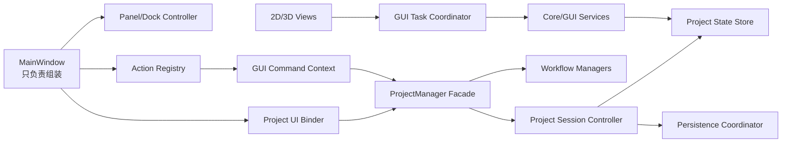

# PlaScan GUI Architecture Refactor Plan

> 本计划用于逐步重构 `src/gui`。每个阶段必须能够独立编译、测试和合并，禁止一次性重写整个 GUI。

**目标：** 统一 Widget/Dock 生命周期、动作状态、异步任务和项目持久化边界，逐步缩小
`MainWindow`、`CameraModel3DDialog`、`ProjectManager` 等超大类，使界面行为稳定且便于继续增加功能。

**技术栈：** C++17、Qt 6 Widgets、QRhi/Vulkan、QtConcurrent、CMake、GTest/CTest。

**执行约束：**

- 只使用 `E:\code\plascan\build\windows-vcpkg-cuda-release` 构建目录。
- 不回滚工作区内已有的 MVS、网格、CLI 或文档改动。
- 重构阶段不改变项目文件格式、摄影测量算法和用户可见功能语义。
- 不在 Widget、Dialog 或 `MainWindow` 的 GUI 线程中执行影像解码、ZIP、点云文件、GDAL 或模型文件 IO。
- 每个阶段先补行为测试，再移动职责；删除旧代码前必须通过新旧行为对照测试。

---

## 当前基线

截至 2026-07-28，主要大文件为：

| 文件 | 约行数 | 主要问题 |
|---|---:|---|
| `dialogs/CameraModel3DDialog.cpp` | 4070 | Dialog、QRhi 渲染、相机选择、点云 IO、点编辑混在一起 |
| `project/manager/ProjectDenseReconstructionManager.cpp` | 3190 | 参数解析、任务编排、结果登记、进度 UI 混合 |
| `main_window/MainWindow.cpp` | 3142 | 组件创建、信号路由、项目状态、视图状态和 Dock 管理混合 |
| `project/manager/ProjectManager.cpp` | 2679 | 项目会话、导入、引用数据、工作流和对话框协调混合 |
| `main_window/MenuWorkflowController.cpp` | 2648 | 动作状态、参数对话框和任务启动混合 |
| `menu/MainMenu.cpp` | 1995 | QAction 创建、菜单布局、工具栏布局和状态策略混合 |
| `project/data/ProjectData.cpp` | 1884 | 内存状态、归档格式、恢复缓存和后台写队列混合 |
| `widgets/DataTreeWidget.cpp` | 1412 | JSON 解释、树模型、图标、上下文菜单和激活逻辑混合 |
| `widgets/CanvasWidget.cpp` | 1196 | 画布状态、影像加载、匹配加载和覆盖层调度混合 |

第一轮响应性修复已经完成：项目保存、匹配查看器和点云保存已移出 GUI 线程，Dock 恢复和 JSON
原子写入已统一。本计划不重复这些工作，而是在现有实现上继续拆分职责。

---

## 目标边界



边界规则：

1. `MainWindow` 只创建顶层组件、安装控制器并连接少量顶层信号。
2. QDockWidget 由 `MainWindow` 所有，但可见性、菜单动作、默认布局和恢复状态只由一个控制器管理。
3. QAction 只能在动作注册表中创建一次；菜单和工具栏只引用同一个 QAction。
4. Dialog 只收集和校验参数，不直接执行长任务或修改项目 JSON。
5. Widget/View 只渲染内存 DTO，不直接读取项目归档或业务 JSON。
6. 项目内存状态和磁盘持久化分离；后台线程只处理不可变快照。
7. 所有异步回调必须有 owner 生命周期和 generation/cancellation 检查。

---

## 阶段 1：建立重构保护网

**目标：** 在移动代码前固化当前用户可见行为，并建立可以量化的约束。

**修改范围：**

- `tests/test_gui_project_utils.cpp`
- 新增 `tests/gui/` 下按组件拆分的 GTest 文件
- `tests/CMakeLists.txt`
- `src/gui/cmake/GuiSources.cmake`

**任务：**

- [ ] 将当前 500 多项混合测试按 `main_window`、`project`、`views`、`dialogs`、`widgets` 拆成独立目标。
- [ ] 保留必要的源码架构断言，但把可通过真实对象验证的字符串测试改成行为测试。
- [ ] 增加项目打开、立即关闭、快速切换项目、连续保存的事件循环测试。
- [x] 增加 Dock 保存/恢复、旧版本布局迁移、面板动作同步测试。
- [ ] 增加匹配查看器快速切换像对时丢弃过期结果的测试。
- [ ] 增加点云连续删除、撤销、切换点云时后台保存顺序测试。
- [ ] 生成 GUI 文件行数和直接 IO include 清单，作为后续阶段的基线报告。

**验收：**

```powershell
cmake --build E:\code\plascan\build\windows-vcpkg-cuda-release `
  --config Release -j 4 --target test_gui_project_utils test_project_data
```

- 测试目标可独立运行，不依赖全量 CTest 的动态发现成功。
- 重构涉及的组件均有生命周期、状态恢复和异步过期结果测试。

---

## 阶段 2：统一 Widget 和 Dock 管理

**目标：** 解决面板默认不显示、动作勾选状态不同步、项目布局覆盖应用布局等问题。

**修改范围：**

- `main_window/WorkspacePanelController.h/.cpp`
- `main_window/MainWindow.h/.cpp`
- `config/manager/WindowStateManager.h/.cpp`
- `menu/MainMenu.h/.cpp`
- 新增 `main_window/WorkspacePanelDescriptor.h`

**设计：**

- 定义稳定 `PanelId`：`Workspace`、`Properties`、`Photos`、`Log`。
- `WorkspacePanelDescriptor` 保存 Dock 指针、QAction 指针、默认区域、是否为项目必需面板。
- `WorkspacePanelController` 成为面板可见性和动作状态的唯一入口。
- `WindowStateManager` 只保存应用窗口 geometry；项目级 Dock state 继续保存到项目 UI 配置。
- 当前版本 Dock state 恢复成功后不再二次应用旧的布尔可见性字段。
- 旧项目或损坏状态统一迁移到“工作区 + 属性在左、照片在底部”的默认布局。

**任务：**

- [x] 用注册表替代 `MainWindow` 中散落的 `_workspaceDock/_propertiesDock/...` 显示逻辑。
- [x] 将“视图 > 窗口”菜单完全由面板注册表生成。
- [ ] 删除重复的面板指针别名和直接 `show()/hide()/setVisible()` 调用。
- [ ] 在项目打开、关闭和工作区模式变化后只调用一次 `syncActions()`。
- [x] 明确面板关闭按钮语义：隐藏面板，不销毁内容 Widget。
- [x] 增加“恢复默认窗口布局”动作，并使用同一控制器执行。

**验收：**

- 任意方式显示/隐藏面板后，菜单勾选状态立即一致。
- 打开无 UI 配置、旧 UI 配置、损坏 UI 配置的项目时，工作区、属性和照片均可见。
- 项目布局不会覆盖全局窗口尺寸，全局窗口尺寸也不会覆盖项目 Dock 布局。

---

## 阶段 3：缩小 MainWindow

**目标：** 将 `MainWindow` 降为顶层组合根，不再承担项目和视图业务逻辑。

**新增组件：**

- `main_window/MainWindowProjectBinder.h/.cpp`
- `main_window/MainWindowViewRouter.h/.cpp`
- `main_window/MainWindowStatusController.h/.cpp`

**职责：**

- `MainWindowProjectBinder`：连接 `ProjectManager`、`ProjectUiHydrator`、工作区树、照片条和属性面板。
- `MainWindowViewRouter`：管理当前模型/影像/匹配/观测网络视图及工具栏模式。
- `MainWindowStatusController`：管理状态栏任务、进度、取消和短消息。
- `MainWindow`：创建对象、安装 Dock/Menu/Toolbar，并持有控制器。

**任务：**

- [ ] 移出项目打开/关闭后的 UI 刷新连接。
- [ ] 移出照片选择、资源选择、模型激活和影像激活路由。
- [ ] 移出状态栏进度和任务快照逻辑。
- [ ] 保留 `MainWindow` 的稳定只读访问器，禁止公开可变 Widget 指针。
- [ ] 清理已被控制器替代的成员和桥接槽。

**验收指标：**

- `MainWindow.cpp` 低于 1200 行，最终目标低于 800 行。
- `MainWindow` 不包含项目 JSON 键名、文件 IO 或具体工作流参数。
- 主窗口相关行为测试保持通过。

---

## 阶段 4：统一菜单、工具栏和命令状态

**目标：** 解决 QAction 重复创建、菜单与工具栏状态不一致、增加按钮需要修改多个位置的问题。

**新增组件：**

- `menu/ActionRegistry.h/.cpp`
- `menu/GuiCommandId.h`
- `menu/GuiCommandContext.h/.cpp`
- `menu/ToolbarSchema.h/.cpp`

**设计：**

- 每个命令有稳定 `GuiCommandId`、标题、图标 token、快捷键、适用视图和启用条件。
- `ActionRegistry` 创建并拥有 QAction。
- `MainMenu` 只定义菜单顺序；`ToolbarSchema` 只定义工具栏分组。
- `GuiCommandContext` 根据项目状态、当前视图、选中资源和任务忙碌状态更新 QAction。
- 三维、影像和匹配查看器使用不同工具组，共用的缩放、重置命令引用同一个动作。

**任务：**

- [ ] 迁移缩放、重置、相机、图像、特征点、蒙版、深度图等现有动作。
- [ ] 消除 `MainWindow`、`MainMenu` 和各 Widget 中的重复 enabled/checked 更新。
- [ ] 图标尺寸、按钮尺寸、分隔符、下拉箭头统一由 `ToolbarButton`/schema 控制。
- [ ] 快捷键只在动作注册表声明一次。
- [ ] 为命令状态矩阵增加参数化 GTest。

**验收：**

- 一个新命令只需注册元数据、处理函数和菜单/工具栏位置，不再复制 QAction。
- 在模型、影像、匹配视图间切换时，无效工具不会显示或保持可点击。
- 菜单、工具栏、快捷键触发同一处理路径。

---

## 阶段 5：拆分项目状态与持久化

**目标：** 让 `ProjectData` 只表达项目状态，让归档和恢复写入成为独立服务。

**新增组件：**

- `project/data/ProjectStateStore.h/.cpp`
- `project/persistence/ProjectPersistenceCoordinator.h/.cpp`
- `project/persistence/ProjectPersistenceSnapshot.h`
- `project/persistence/ProjectRecoveryStore.h/.cpp`
- `project/manager/ProjectSessionController.h/.cpp`

**职责：**

- `ProjectStateStore`：core/results/config 的内存状态、版本号和变更信号。
- `ProjectPersistenceCoordinator`：串行快照队列、ZIP 批量写入、保存完成状态。
- `ProjectRecoveryStore`：`.plascan_tmp` 原子写入和异常恢复。
- `ProjectSessionController`：create/open/save/close 和项目切换 generation。
- `ProjectData` 在迁移期作为兼容 facade，逐步删除实现。

**任务：**

- [ ] 用不可变 `ProjectPersistenceSnapshot` 替代后台线程访问 QObject。
- [ ] 给每次修改增加 revision，保存完成只清除对应 revision 的 dirty 状态。
- [ ] 正式保存、自动归档同步和恢复快照使用同一串行队列。
- [ ] 明确关闭项目时最后快照、正在保存时切换项目和保存失败重试语义。
- [ ] 将 `ProjectManager` 的会话逻辑迁入 `ProjectSessionController`。
- [ ] 保持旧 `.plascan`、拆分 results 和中文路径兼容测试。

**验收指标：**

- `ProjectData.cpp` 低于 700 行。
- 项目状态 getter 不执行磁盘 IO。
- 快速连续保存只提交必要快照，保存完成不会错误清除后续修改。
- 项目关闭和应用退出不会丢失最后一次恢复快照。

---

## 阶段 6：拆分三维视图

**目标：** 将 `CameraModel3DDialog.cpp` 中的 Dialog、场景状态、QRhi 渲染、资源加载和点编辑分离。

**目标目录：**

```text
views/camera_scene/
├── CameraSceneWidget.h/.cpp
├── CameraSceneState.h/.cpp
├── CameraSceneRenderer.h/.cpp
├── CameraSceneGpuResources.h/.cpp
├── CameraSceneLoader.h/.cpp
├── CameraScenePointEditor.h/.cpp
├── CameraSceneCameraOverlay.h/.cpp
└── CameraSceneViewMath.h/.cpp
```

**任务：**

- [ ] 首先移动现有 `CameraSceneWidget`，不改变行为。
- [ ] 将 PLY/OBJ/XYZ 读取和纹理准备移入 `CameraSceneLoader`。
- [ ] 将 QRhi pipeline、buffer、texture 生命周期移入 renderer/resource 对象。
- [ ] 将框选、删除、撤销和后台合并保存移入 `CameraScenePointEditor`。
- [ ] 将从属相机、缩略图、前景/后景图像选择移入 camera overlay 控制器。
- [ ] Dialog 只保留布局、按钮和参数连接。
- [ ] 对加载 generation、设备丢失、窗口销毁和连续编辑增加测试。

**验收指标：**

- `CameraModel3DDialog.cpp` 低于 500 行。
- 单个 camera scene 实现文件尽量不超过 600 行，最终向 400 行目标收敛。
- QRhi 资源只在渲染线程/约定生命周期内创建和释放。
- 点云保存失败不回滚内存编辑，但明确显示未落盘状态并允许重试。

---

## 阶段 7：拆分二维画布、工作区树和照片条

**目标：** View 不再解释项目 JSON，也不直接承担资源加载策略。

**新增组件：**

- `views/ImageDocumentController.h/.cpp`
- `views/MatchPairDocumentLoader.h/.cpp`
- `widgets/ProjectTreeModel.h/.cpp`
- `widgets/ProjectTreePresenter.h/.cpp`
- `widgets/PhotoListModel.h/.cpp`
- `widgets/ThumbnailLoader.h/.cpp`

**任务：**

- [ ] 将匹配影像、匹配点解析和 generation 管理从 `CanvasWidget` 移入 document loader。
- [ ] `CanvasWidget` 只接收 QImage、点集和 overlay DTO。
- [ ] 将 `DataTreeWidget` 的 JSON 到节点转换移入 `ProjectTreeModel`。
- [ ] 使用稳定 resource ID，而不是显示文本判断节点类型。
- [ ] 将上下文菜单命令路由移入 presenter/controller。
- [ ] 将照片缩略图加载、缓存和取消移入共享 `ThumbnailLoader`。
- [ ] 工作区树和照片条共用项目影像 identity/path 解析服务。

**验收指标：**

- `CanvasWidget.cpp`、`DataTreeWidget.cpp` 均低于 700 行。
- Widget 源文件不直接 include ZIP、GDAL、OpenCV 文件读取或项目归档实现。
- 删除项目影像后，工作区、照片条和匹配查看器都只展示当前项目仍引用的影像。

---

## 阶段 8：统一 Dialog 和长任务执行

**目标：** Dialog 不再直接启动业务线程，取消操作不等待 GUI 线程。

**修改范围：**

- `dialogs/`
- `tasks/GuiTaskRunner.h`
- `project/manager/ProjectTaskDispatcher.h/.cpp`
- `widgets/TaskStatusWidget.h/.cpp`

**设计：**

- Dialog 输出强类型 Options DTO。
- Manager/Service 校验项目状态并创建 TaskRequest。
- `ProjectTaskDispatcher` 负责队列、进度、取消和结果。
- `GuiTaskRunner` 保留轻量视图加载任务，并统一 cancellation/generation。
- 关闭进度对话框只发出取消请求，不在 GUI 线程 `waitForFinished()`。

**任务：**

- [ ] 先迁移打开项目、添加文件夹、匹配查看器和点云保存等高频路径。
- [ ] 再迁移空三、深度图、模型、DEM、正射影像长任务。
- [ ] 将散落的 `QProgressDialog` 创建收敛到统一进度 presenter。
- [ ] 将错误结构统一为 `operation/path/stage/message/recovery`。
- [ ] 增加取消后立即响应、后台安全结束和重复启动防护测试。

**验收：**

- GUI 线程无主动等待后台线程的代码。
- 取消按钮在一个事件循环周期内恢复响应。
- 同一任务不会重复启动，关闭项目后旧任务回调不会更新新项目。

---

## 阶段 9：清理 ProjectManager 和工作流控制器

**目标：** `ProjectManager` 只保留兼容 facade，具体业务由已有 manager/service 承担。

**任务：**

- [ ] 将项目会话迁至 `ProjectSessionController`。
- [ ] 将参考数据、质量报告、标记点和资源清理调用收敛到对应 service。
- [ ] 将 Dialog 创建从业务 manager 移到 UI controller。
- [ ] `MenuWorkflowController` 只处理命令到 Options/TaskRequest 的转换。
- [ ] `ProjectDenseReconstructionManager` 拆分为深度估计、融合、密集点云和结果登记四个编排器。
- [ ] 删除 facade 中已无调用者的方法，避免继续增加转发层。

**验收指标：**

- `ProjectManager.cpp` 低于 800 行。
- `ProjectDenseReconstructionManager.cpp` 单文件低于 1000 行，后续继续收敛。
- manager/service 不 include 具体 Dialog 头文件。

---

## 阶段 10：架构规则和最终验收

**任务：**

- [ ] 更新 `docs/PROJECT_ARCHITECTURE.md` 的最终 GUI 目录和职责。
- [ ] 增加 CMake/测试规则，阻止 `src/core` 依赖 `src/gui`。
- [ ] 增加 GUI 线程直接 IO 的 include/调用审计。
- [ ] 删除迁移期 facade、旧 Dock 状态分支和重复 QAction。
- [ ] 运行完整 GUI、项目、SfM、MVS 和地形相关测试。
- [ ] 使用真实中文路径项目验证打开、保存、取消、关闭和重开。
- [ ] 手动验证模型、影像、匹配、深度和照片工作区切换。

**最终验收命令：**

```powershell
cmake --build E:\code\plascan\build\windows-vcpkg-cuda-release `
  --config Release -j 4 --target plascan_gui test_gui_project_utils test_project_data

ctest --test-dir E:\code\plascan\build\windows-vcpkg-cuda-release `
  -C Release --output-on-failure -R "Gui|Project|Match|Sfm|Mvs|Terrain"
```

**最终质量门：**

- 应用启动、打开项目、添加文件夹、查看匹配和取消任务时 GUI 保持响应。
- Dock、菜单勾选、工具栏模式和项目恢复状态一致。
- 没有 Widget/Dialog 直接修改项目 JSON 或归档。
- 没有后台任务通过裸 `this` 回调已销毁对象。
- 行为测试替代大部分源码字符串测试。
- 新增工具栏命令和工作区面板不需要修改多个状态同步分支。

---

## 推荐实施顺序

1. 阶段 1：测试拆分和基线。
2. 阶段 2：Widget/Dock 管理。
3. 阶段 4：动作和工具栏注册表。
4. 阶段 3：缩小 MainWindow。
5. 阶段 5：项目状态与持久化。
6. 阶段 6：三维视图拆分。
7. 阶段 7：二维视图和工作区模型。
8. 阶段 8：Dialog/任务统一。
9. 阶段 9：Manager 清理。
10. 阶段 10：架构规则和全量验收。

阶段 2 和阶段 4 应优先完成，因为后续所有 Widget、视图和功能都会依赖统一的面板与动作状态模型。
